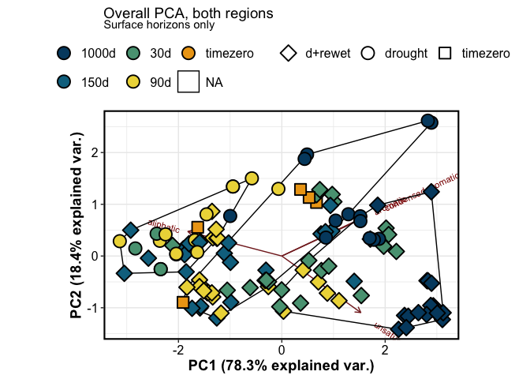
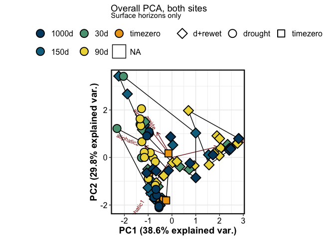
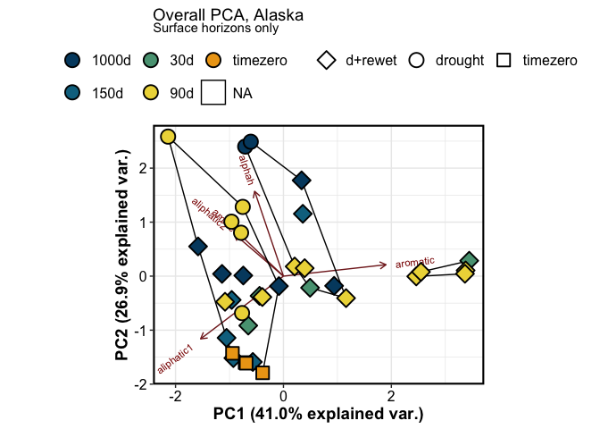
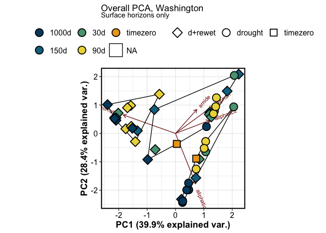
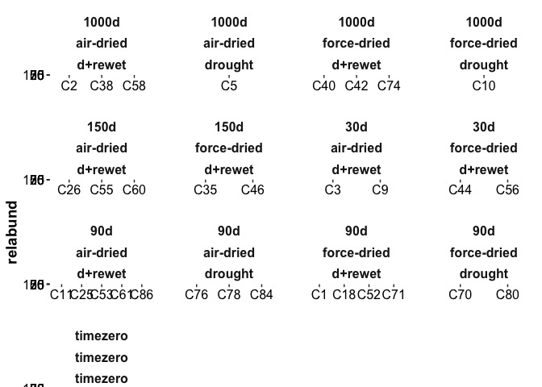
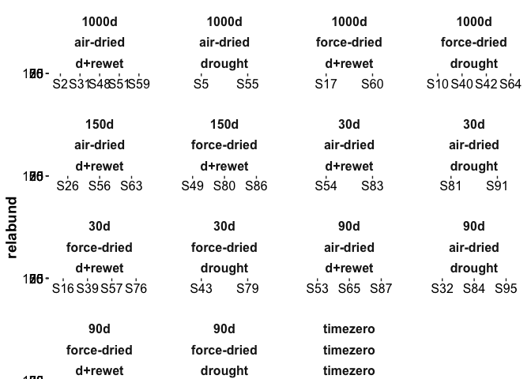
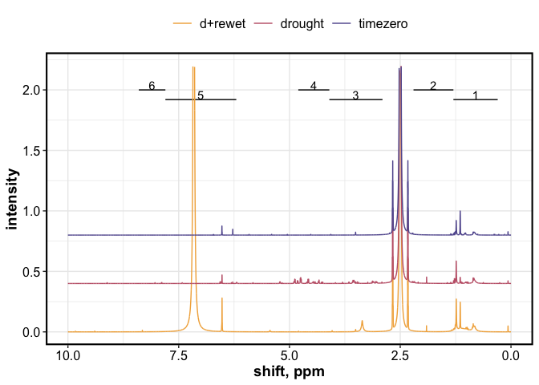
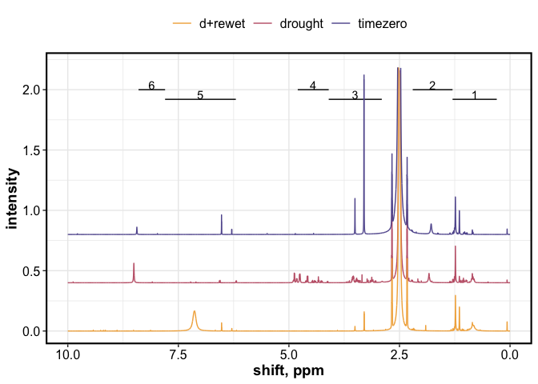

Untitled
================

------------------------------------------------------------------------

## FTICR

### Stats – PERMANOVA

    ## [1] "FTICR -- including top and bottom depths"

    ## # A tibble: 7 × 6
    ##   term          df SumOfSqs      R2 statistic p.value
    ##   <chr>      <dbl>    <dbl>   <dbl>     <dbl>   <dbl>
    ## 1 site           1  0.0173  0.0187      15.8    0.001
    ## 2 depth          1  0.133   0.144      122.     0.001
    ## 3 length         3  0.369   0.399      113.     0.001
    ## 4 saturation     1  0.205   0.222      188.     0.001
    ## 5 drying         1  0.00844 0.00913      7.74   0.005
    ## 6 Residual     226  0.247   0.267       NA     NA    
    ## 7 Total        234  0.925   1           NA     NA

    ## [1] "FTICR -- including top depth only"

    ## # A tibble: 6 × 6
    ##   term          df SumOfSqs     R2 statistic p.value
    ##   <chr>      <dbl>    <dbl>  <dbl>     <dbl>   <dbl>
    ## 1 site           1  0.00689 0.0202      7.74   0.011
    ## 2 length         3  0.194   0.569      72.5    0.001
    ## 3 saturation     1  0.0710  0.209      79.8    0.001
    ## 4 drying         1  0.00955 0.0280     10.7    0.003
    ## 5 Residual     110  0.0979  0.288      NA     NA    
    ## 6 Total        117  0.340   1          NA     NA

### Stats – Clustering and PCA

(surface soils only)

<!-- -->

### Van Krevelens

### Relative abundance

------------------------------------------------------------------------

## NMR

### Stats – PERMANOVA

    ## # A tibble: 6 × 6
    ##   term          df SumOfSqs       R2 statistic p.value
    ##   <chr>      <dbl>    <dbl>    <dbl>     <dbl>   <dbl>
    ## 1 site           1   0.490  0.0451       5.20    0.009
    ## 2 length         3   1.25   0.115        4.41    0.001
    ## 3 saturation     1   2.99   0.275       31.8     0.001
    ## 4 drying         1   0.0102 0.000936     0.108   0.924
    ## 5 Residual      70   6.59   0.606       NA      NA    
    ## 6 Total         77  10.9    1           NA      NA

### Stats – PCA and clustering

<!-- -->

<!-- --><!-- -->

## NMR relabund

<!-- --><!-- -->

## NMR specctra

<!-- --><!-- -->
