Untitled
================

------------------------------------------------------------------------

## EXPERIMENTAL DESIGN

| site       | drying      | saturation | timezero | 30d | 90d | 150d | 1000d |
|:-----------|:------------|:-----------|:---------|:----|:----|:-----|:------|
| Alaska     | air-dried   | drought    |          |     | x   |      | x     |
| Alaska     | air-dried   | d+rewet    |          | x   | x   | x    | x     |
| Alaska     | force-dried | drought    |          |     | x   |      | x     |
| Alaska     | force-dried | d+rewet    |          | x   | x   | x    | x     |
| Alaska     | NA          | timezero   | x        |     |     |      |       |
| Washington | air-dried   | drought    |          | x   | x   |      | x     |
| Washington | air-dried   | d+rewet    |          | x   | x   | x    | x     |
| Washington | force-dried | drought    |          | x   | x   |      | x     |
| Washington | force-dried | d+rewet    |          | x   | x   | x    | x     |
| Washington | NA          | timezero   | x        |     |     |      |       |

------------------------------------------------------------------------

## FTICR

### Stats – PERMANOVA

    ## [1] "FTICR -- including top and bottom depths"

| term       |  df |  SumOfSqs |        R2 |  statistic | p.value |
|:-----------|----:|----------:|----------:|-----------:|--------:|
| site       |   1 | 0.0128283 | 0.0152980 |  13.824014 |   0.001 |
| depth      |   1 | 0.1542465 | 0.1839414 | 166.218460 |   0.001 |
| length     |   3 | 0.3687041 | 0.4396856 | 132.440450 |   0.001 |
| saturation |   1 | 0.2054835 | 0.2450424 | 221.432268 |   0.001 |
| drying     |   1 | 0.0084570 | 0.0100851 |   9.113402 |   0.002 |
| Residual   | 215 | 0.1995145 | 0.2379243 |         NA |      NA |
| Total      | 222 | 0.8385631 | 1.0000000 |         NA |      NA |

    ## [1] "FTICR -- including top depth only"

| term       |  df |  SumOfSqs |        R2 | statistic | p.value |
|:-----------|----:|----------:|----------:|----------:|--------:|
| site       |   1 | 0.0058731 | 0.0176578 |  6.507569 |   0.008 |
| length     |   3 | 0.1936424 | 0.5821997 | 71.520890 |   0.001 |
| saturation |   1 | 0.0711952 | 0.2140534 | 78.886785 |   0.001 |
| drying     |   1 | 0.0095525 | 0.0287202 | 10.584498 |   0.002 |
| Residual   | 105 | 0.0947623 | 0.2849096 |        NA |      NA |
| Total      | 111 | 0.3326048 | 1.0000000 |        NA |      NA |

### Stats – Clustering and PCA

(surface soils only)

Click for details

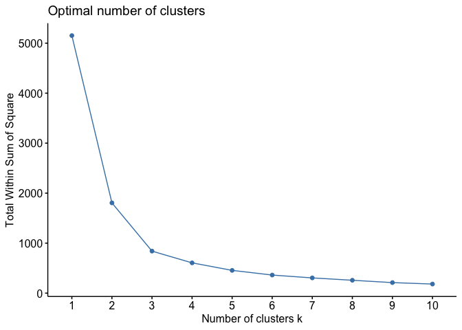<!-- -->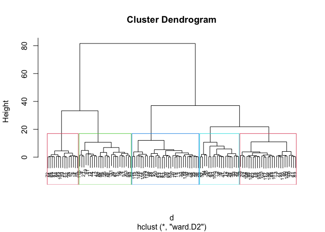<!-- -->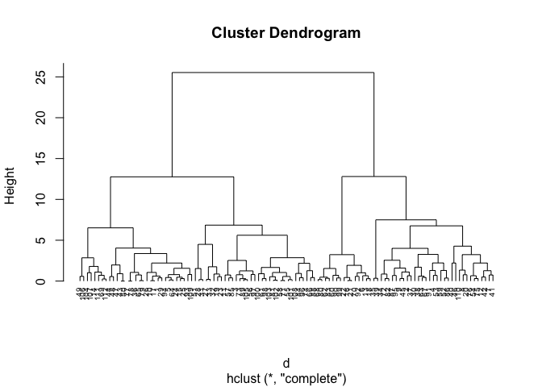<!-- -->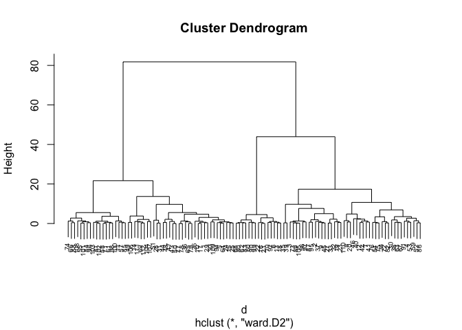<!-- -->

    ## [1] "hierarchical clustering: three clusters"

    ##   cluster  n
    ## 1       1 53
    ## 2       2 44
    ## 3       3 15

#### SAME OVERALL PCA, GROUPED DIFFERENT WAYS

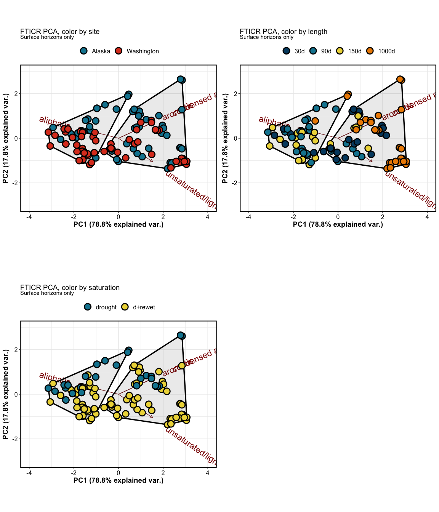<!-- -->

### Van Krevelens

### Relative abundance

    ## [1] "Alaska soils, 0-5cm"

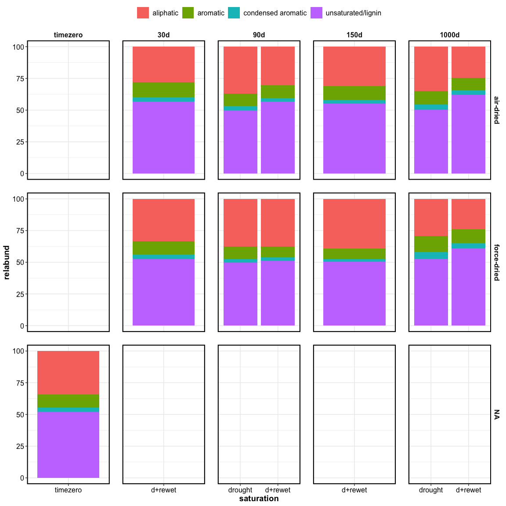<!-- -->

    ## [1] "Washington soils, 0-5cm"

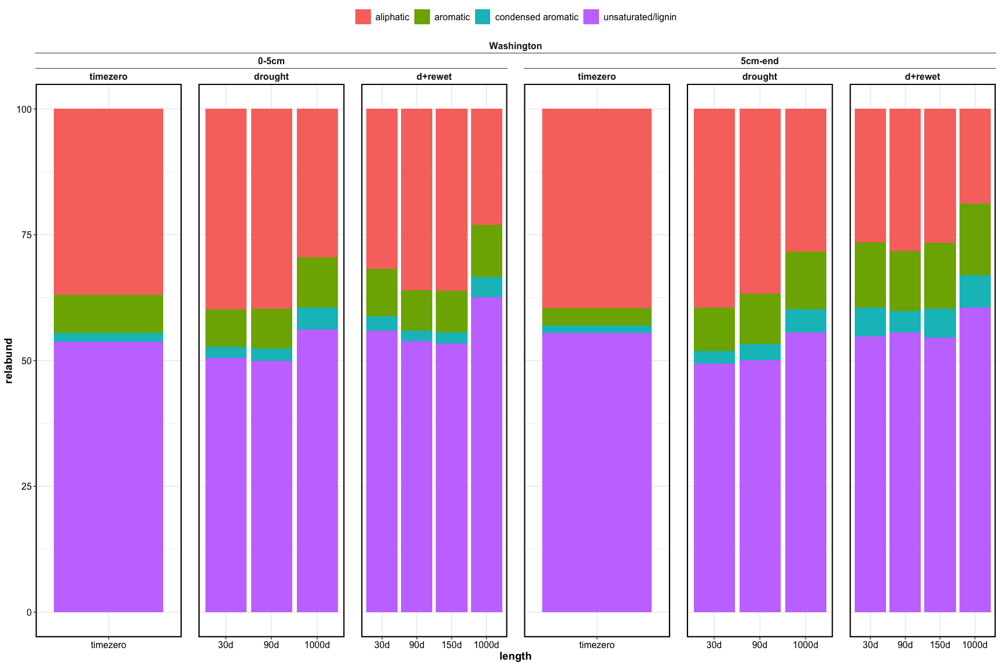<!-- -->

Click for relabund per core

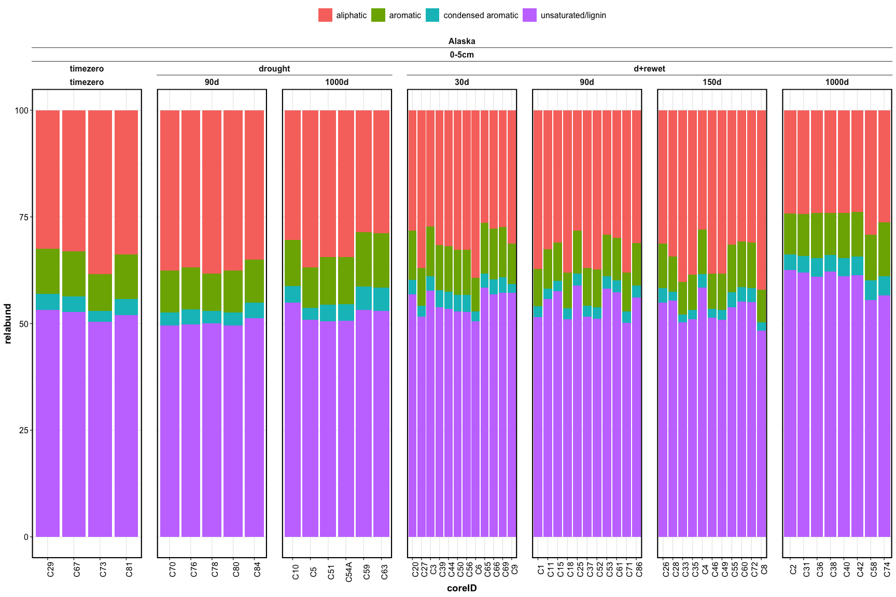<!-- -->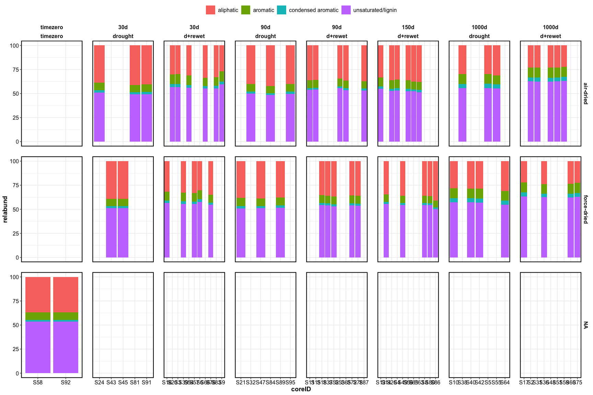<!-- -->

------------------------------------------------------------------------

------------------------------------------------------------------------

## NMR

### Stats – PERMANOVA

| term       |  df |   SumOfSqs |        R2 |  statistic | p.value |
|:-----------|----:|-----------:|----------:|-----------:|--------:|
| site       |   1 |  0.4898248 | 0.0450575 |  5.2003870 |   0.005 |
| length     |   3 |  1.2465270 | 0.1146642 |  4.4113887 |   0.002 |
| saturation |   1 |  2.9907954 | 0.2751142 | 31.7527690 |   0.001 |
| drying     |   1 |  0.0101735 | 0.0009358 |  0.1080101 |   0.931 |
| Residual   |  70 |  6.5933046 | 0.6064980 |         NA |      NA |
| Total      |  77 | 10.8711069 | 1.0000000 |         NA |      NA |

### Stats – PCA and clustering

Click for details

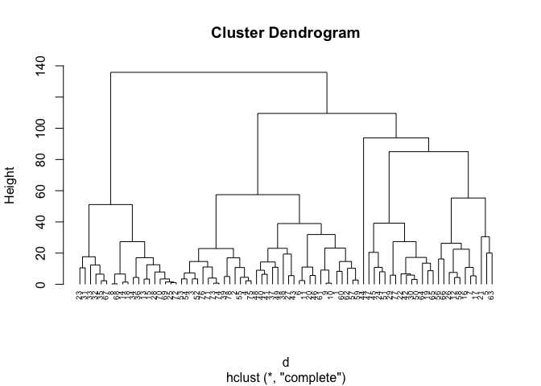<!-- -->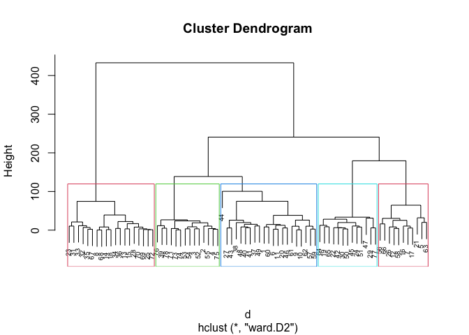<!-- --><!-- -->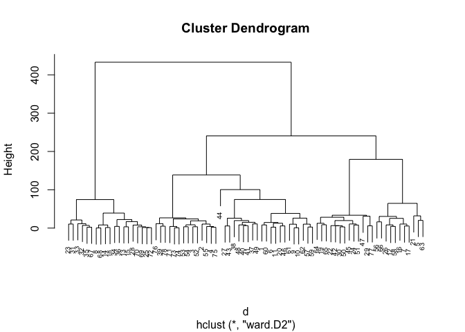<!-- -->

    ## [1] "NMR hierarchical clustering: two clusters"

    ##   cluster  n
    ## 1       1 59
    ## 2       2 19

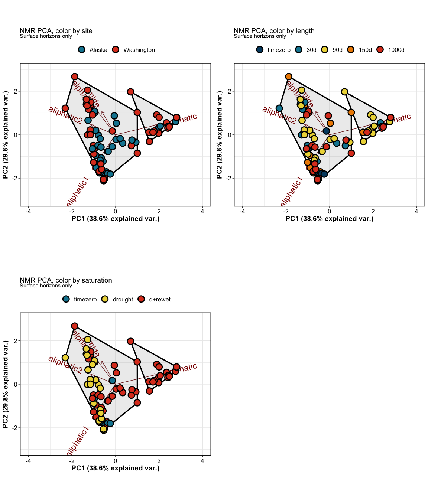<!-- -->

<!-- --><!-- -->

## NMR relabund

Click for Relative abundance by core

    ## [1] "relative abundance: Alaska"

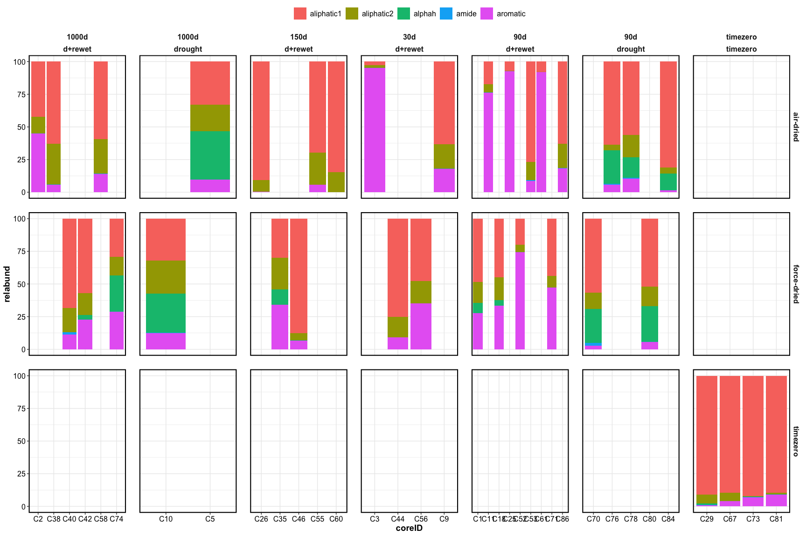<!-- -->

    ## [1] "relative abundance: Washington"

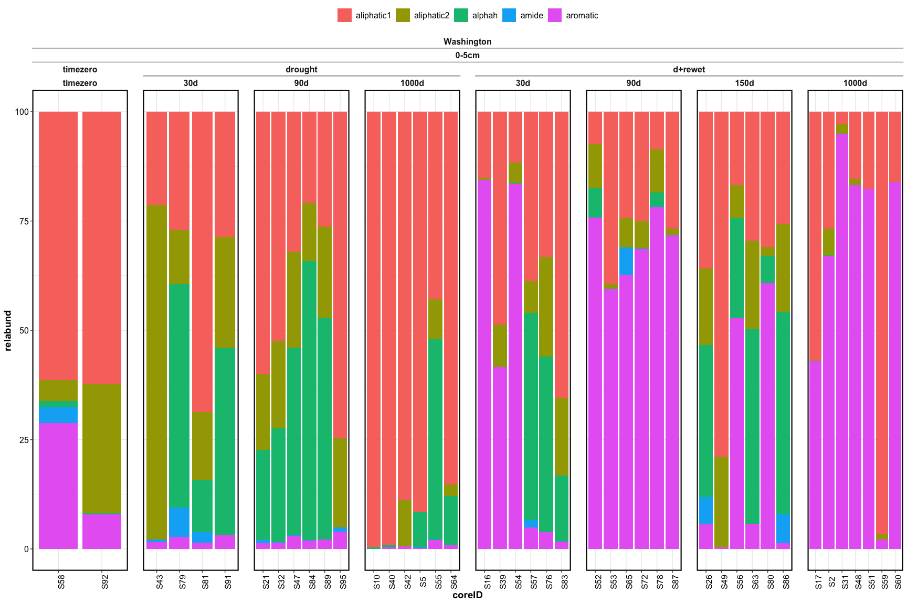<!-- -->

## NMR specctra

<!-- --><!-- -->

------------------------------------------------------------------------

## Session Info

Session Info

Date run: 2025-07-02

    ## R version 4.5.0 (2025-04-11)
    ## Platform: aarch64-apple-darwin20
    ## Running under: macOS Sequoia 15.5
    ## 
    ## Matrix products: default
    ## BLAS:   /Library/Frameworks/R.framework/Versions/4.5-arm64/Resources/lib/libRblas.0.dylib 
    ## LAPACK: /Library/Frameworks/R.framework/Versions/4.5-arm64/Resources/lib/libRlapack.dylib;  LAPACK version 3.12.1
    ## 
    ## locale:
    ## [1] en_US.UTF-8/en_US.UTF-8/en_US.UTF-8/C/en_US.UTF-8/en_US.UTF-8
    ## 
    ## time zone: America/Los_Angeles
    ## tzcode source: internal
    ## 
    ## attached base packages:
    ## [1] stats     graphics  grDevices utils     datasets  methods   base     
    ## 
    ## other attached packages:
    ##  [1] ggConvexHull_0.1.0  ggpubr_0.6.0        factoextra_1.0.7   
    ##  [4] cluster_2.1.8.1     picarro.data_0.1.1  vegan_2.7-1        
    ##  [7] permute_0.9-7       nmrrr_1.0.0         soilpalettes_0.1.0 
    ## [10] PNWColors_0.1.0     googlesheets4_1.1.1 ggbiplot_0.55      
    ## [13] agricolae_1.3-7     car_3.1-3           carData_3.0-5      
    ## [16] nlme_3.1-168        stringi_1.8.7       lubridate_1.9.4    
    ## [19] forcats_1.0.0       stringr_1.5.1       dplyr_1.1.4        
    ## [22] purrr_1.0.4         readr_2.1.5         tidyr_1.3.1        
    ## [25] tibble_3.3.0        ggplot2_3.5.2       tidyverse_2.0.0    
    ## [28] tarchetypes_0.13.1  targets_1.11.3     
    ## 
    ## loaded via a namespace (and not attached):
    ##  [1] tidyselect_1.2.1   Exact_3.3          rootSolve_1.8.2.4  farver_2.1.2      
    ##  [5] fastmap_1.2.0      digest_0.6.37      base64url_1.4      timechange_0.3.0  
    ##  [9] lifecycle_1.0.4    secretbase_1.0.5   processx_3.8.6     lmom_3.2          
    ## [13] magrittr_2.0.3     compiler_4.5.0     rlang_1.1.6        tools_4.5.0       
    ## [17] igraph_2.1.4       yaml_2.3.10        data.table_1.17.0  ggsignif_0.6.4    
    ## [21] knitr_1.50         labeling_0.4.3     prettyunits_1.2.0  plyr_1.8.9        
    ## [25] RColorBrewer_1.1-3 abind_1.4-8        expm_1.0-0         withr_3.0.2       
    ## [29] grid_4.5.0         googledrive_2.1.1  AlgDesign_1.2.1.2  e1071_1.7-16      
    ## [33] scales_1.4.0       MASS_7.3-65        cli_3.6.5          mvtnorm_1.3-3     
    ## [37] rmarkdown_2.29     generics_0.1.3     rstudioapi_0.17.1  httr_1.4.7        
    ## [41] tzdb_0.5.0         readxl_1.4.5       gld_2.6.7          proxy_0.4-27      
    ## [45] splines_4.5.0      parallel_4.5.0     cellranger_1.1.0   vctrs_0.6.5       
    ## [49] boot_1.3-31        Matrix_1.7-3       callr_3.7.6        hms_1.1.3         
    ## [53] rstatix_0.7.2      ggrepel_0.9.6      Formula_1.2-5      glue_1.8.0        
    ## [57] codetools_0.2-20   ps_1.9.1           cowplot_1.1.3      gtable_0.3.6      
    ## [61] pillar_1.10.2      htmltools_0.5.8.1  R6_2.6.1           evaluate_1.0.3    
    ## [65] lattice_0.22-6     haven_2.5.4        backports_1.5.0    broom_1.0.8       
    ## [69] gargle_1.5.2       DescTools_0.99.60  class_7.3-23       Rcpp_1.0.14       
    ## [73] mgcv_1.9-1         xfun_0.52          fs_1.6.6           pkgconfig_2.0.3

