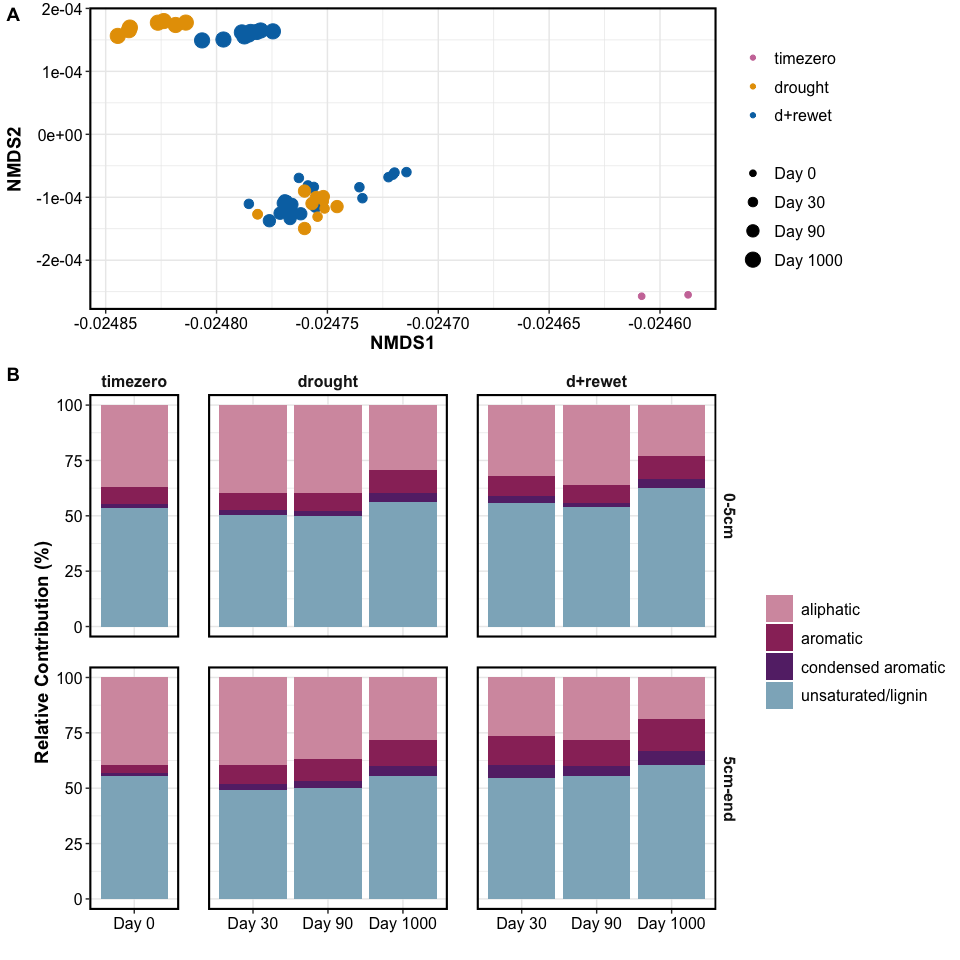
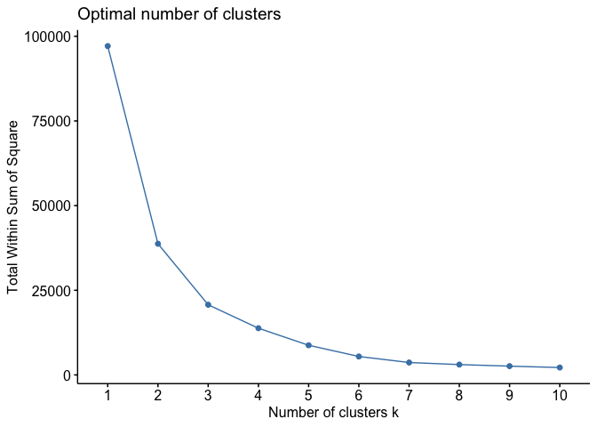
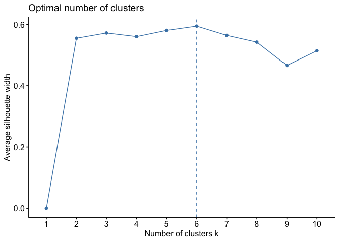
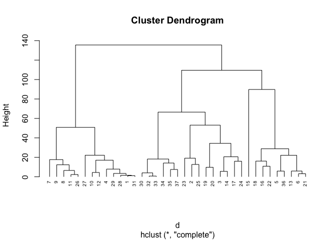
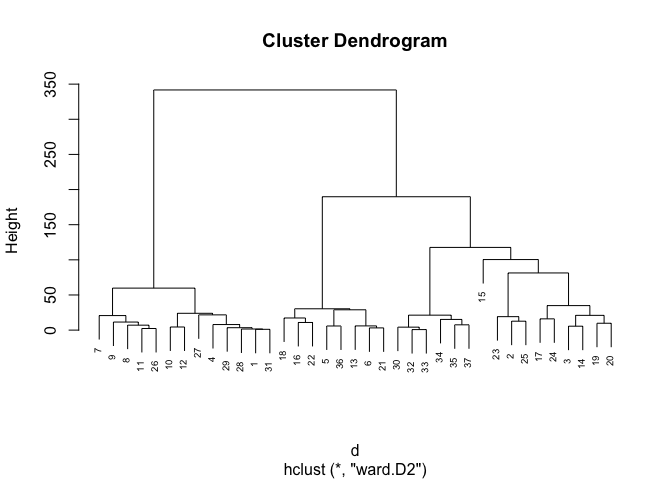
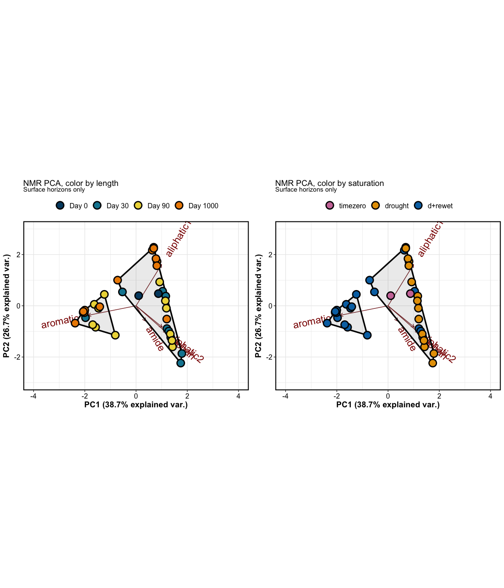
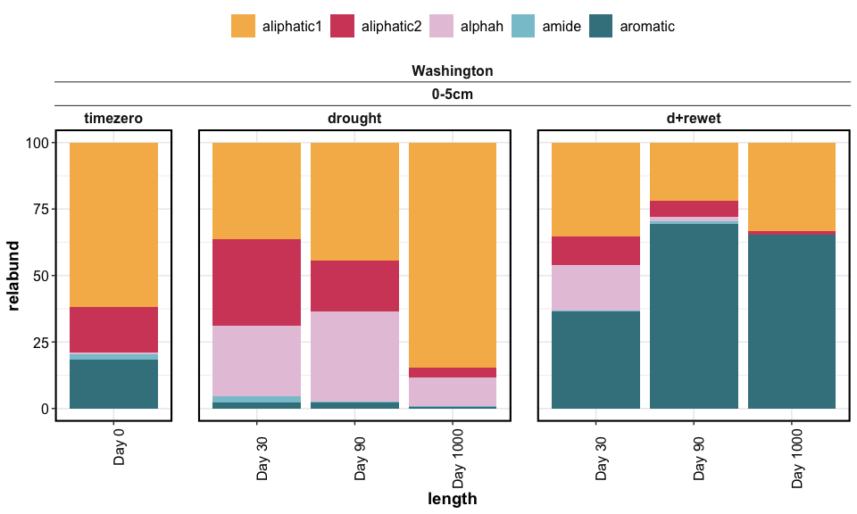
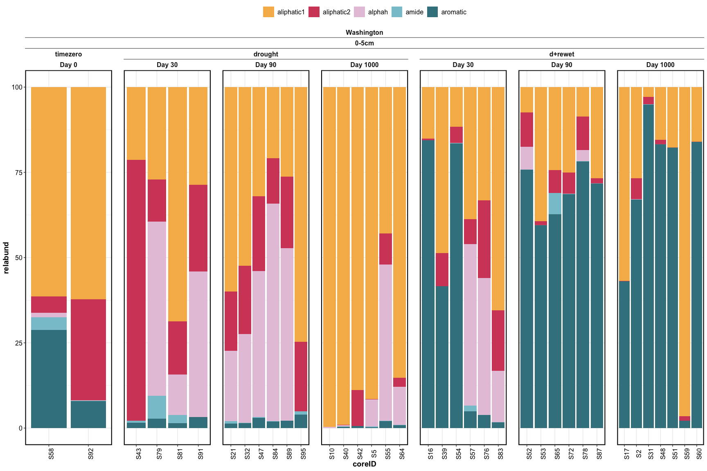
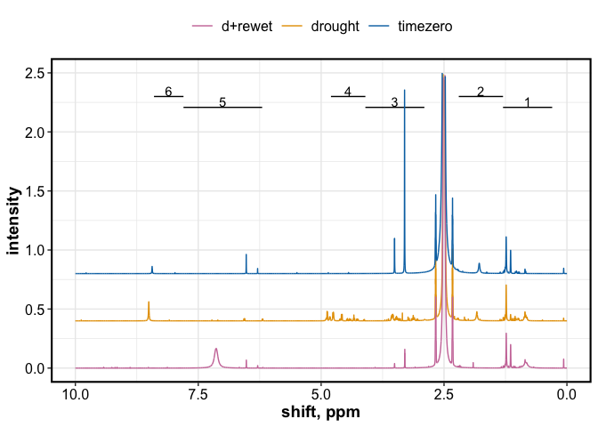

chemistry_report_NEW
================

------------------------------------------------------------------------

## FTICR

### Stats – PERMANOVA

    ## [1] "FTICR -- including top and bottom depths"

| term       |  df |  SumOfSqs |        R2 |  statistic | p.value |
|:-----------|----:|----------:|----------:|-----------:|--------:|
| depth      |   1 | 0.0506674 | 0.1149601 |  88.057141 |   0.001 |
| length     |   2 | 0.2056311 | 0.4665603 | 178.687892 |   0.001 |
| saturation |   1 | 0.1540093 | 0.3494347 | 267.659890 |   0.001 |
| drying     |   1 | 0.0018533 | 0.0042049 |   3.220881 |   0.078 |
| Residual   |  89 | 0.0512099 | 0.1161911 |         NA |      NA |
| Total      |  94 | 0.4407384 | 1.0000000 |         NA |      NA |

    ## [1] "FTICR -- including top depth only"

| term       |  df |  SumOfSqs |        R2 |   statistic | p.value |
|:-----------|----:|----------:|----------:|------------:|--------:|
| length     |   2 | 0.1219450 | 0.7254832 | 189.9259569 |   0.001 |
| saturation |   1 | 0.0420732 | 0.2503049 | 131.0558189 |   0.001 |
| drying     |   1 | 0.0000653 | 0.0003882 |   0.2032546 |   0.676 |
| Residual   |  43 | 0.0138044 | 0.0821262 |          NA |      NA |
| Total      |  47 | 0.1680880 | 1.0000000 |          NA |      NA |

### Stats – Clustering and NMDS — formula

ignoring compound classes, doing clustering/NMDS based on individual
molecules (presence/absence)

    ## 
    ## Call:
    ## metaMDS(comm = jacc, k = 3) 
    ## 
    ## global Multidimensional Scaling using monoMDS
    ## 
    ## Data:     jacc 
    ## Distance: jaccard 
    ## 
    ## Dimensions: 3 
    ## Stress:     8.861388e-05 
    ## Stress type 1, weak ties
    ## Best solution was repeated 10 times in 20 tries
    ## The best solution was from try 11 (random start)
    ## Scaling: centring, PC rotation, halfchange scaling 
    ## Species: scores missing

<!-- --><!-- -->

FTICR NMDS plots:

    ## [1] "color by length"

<!-- -->

    ## [1] "color by saturation - top"

    ## [1] "color by saturation - bottom"

<!-- --><!-- -->

### Relative abundance

<!-- -->

Click for relabund per core

<!-- --><!-- -->

## ——

## NMR

### Stats – PERMANOVA

| term       |  df |   SumOfSqs |         R2 |  statistic | p.value |
|:-----------|----:|-----------:|-----------:|-----------:|--------:|
| length     |   2 |  0.7142123 |  0.1163433 |  3.7384819 |   0.009 |
| saturation |   1 |  2.4083480 |  0.3923136 | 25.2125733 |   0.001 |
| drying     |   1 | -0.0286895 | -0.0046734 | -0.3003454 |   1.000 |
| Residual   |  31 |  2.9611729 |  0.4823673 |         NA |      NA |
| Total      |  36 |  6.1388341 |  1.0000000 |         NA |      NA |

### Stats – PCA and clustering

Click for details

<!-- --><!-- --><!-- --><!-- -->

    ## [1] "NMR hierarchical clustering: two clusters"

    ##   cluster  n
    ## 1       1 13
    ## 2       2 24

<!-- -->

## NMR relabund

<!-- -->

Click for Relative abundance by core

    ## [1] "relative abundance: Washington"

<!-- -->

## NMR spectra

<!-- -->

------------------------------------------------------------------------

## Session Info

Session Info

Date run: 2026-02-13

    ## R version 4.5.0 (2025-04-11)
    ## Platform: aarch64-apple-darwin20
    ## Running under: macOS Sequoia 15.7.3
    ## 
    ## Matrix products: default
    ## BLAS:   /Library/Frameworks/R.framework/Versions/4.5-arm64/Resources/lib/libRblas.0.dylib 
    ## LAPACK: /Library/Frameworks/R.framework/Versions/4.5-arm64/Resources/lib/libRlapack.dylib;  LAPACK version 3.12.1
    ## 
    ## locale:
    ## [1] en_US.UTF-8/en_US.UTF-8/en_US.UTF-8/C/en_US.UTF-8/en_US.UTF-8
    ## 
    ## time zone: America/Los_Angeles
    ## tzcode source: internal
    ## 
    ## attached base packages:
    ## [1] stats     graphics  grDevices utils     datasets  methods   base     
    ## 
    ## other attached packages:
    ##  [1] ggConvexHull_0.1.0  factoextra_1.0.7    cluster_2.1.8.1    
    ##  [4] ggh4x_0.3.1         picarro.data_0.1.1  whistledown_0.1.0  
    ##  [7] vegan_2.7-1         permute_0.9-7       nmrrr_1.0.0        
    ## [10] soilpalettes_0.1.0  PNWColors_0.1.0     googlesheets4_1.1.1
    ## [13] ggbiplot_0.55       agricolae_1.3-7     car_3.1-3          
    ## [16] carData_3.0-5       nlme_3.1-168        stringi_1.8.7      
    ## [19] lubridate_1.9.4     forcats_1.0.0       stringr_1.5.1      
    ## [22] dplyr_1.1.4         purrr_1.0.4         readr_2.1.5        
    ## [25] tidyr_1.3.1         tibble_3.3.0        ggplot2_3.5.2      
    ## [28] tidyverse_2.0.0    
    ## 
    ## loaded via a namespace (and not attached):
    ##  [1] gld_2.6.7          readxl_1.4.5       rlang_1.1.6        magrittr_2.0.3    
    ##  [5] snakecase_0.11.1   e1071_1.7-16       compiler_4.5.0     mgcv_1.9-1        
    ##  [9] callr_3.7.6        vctrs_0.6.5        pkgconfig_2.0.3    fastmap_1.2.0     
    ## [13] backports_1.5.0    labeling_0.4.3     rmarkdown_2.29     tzdb_0.5.0        
    ## [17] haven_2.5.4        ps_1.9.1           xfun_0.53          broom_1.0.8       
    ## [21] parallel_4.5.0     prettyunits_1.2.0  DescTools_0.99.60  R6_2.6.1          
    ## [25] RColorBrewer_1.1-3 boot_1.3-31        cellranger_1.1.0   Rcpp_1.0.14       
    ## [29] knitr_1.50         Matrix_1.7-3       splines_4.5.0      igraph_2.1.4      
    ## [33] timechange_0.3.0   tidyselect_1.2.1   rstudioapi_0.17.1  abind_1.4-8       
    ## [37] yaml_2.3.10        targets_1.11.3     AlgDesign_1.2.1.2  codetools_0.2-20  
    ## [41] processx_3.8.6     lattice_0.22-6     plyr_1.8.9         withr_3.0.2       
    ## [45] evaluate_1.0.3     proxy_0.4-27       pillar_1.10.2      ggpubr_0.6.0      
    ## [49] generics_0.1.3     hms_1.1.3          scales_1.4.0       rootSolve_1.8.2.4 
    ## [53] base64url_1.4      class_7.3-23       glue_1.8.0         janitor_2.2.1     
    ## [57] lmom_3.2           tools_4.5.0        data.table_1.17.0  ggsignif_0.6.4    
    ## [61] Exact_3.3          fs_1.6.6           mvtnorm_1.3-3      cowplot_1.1.3     
    ## [65] grid_4.5.0         googledrive_2.1.1  Formula_1.2-5      cli_3.6.5         
    ## [69] expm_1.0-0         gargle_1.5.2       gtable_0.3.6       rstatix_0.7.2     
    ## [73] digest_0.6.37      ggrepel_0.9.6      farver_2.1.2       htmltools_0.5.8.1 
    ## [77] lifecycle_1.0.4    httr_1.4.7         secretbase_1.0.5   MASS_7.3-65

