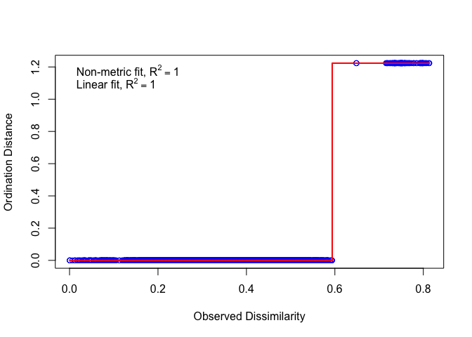
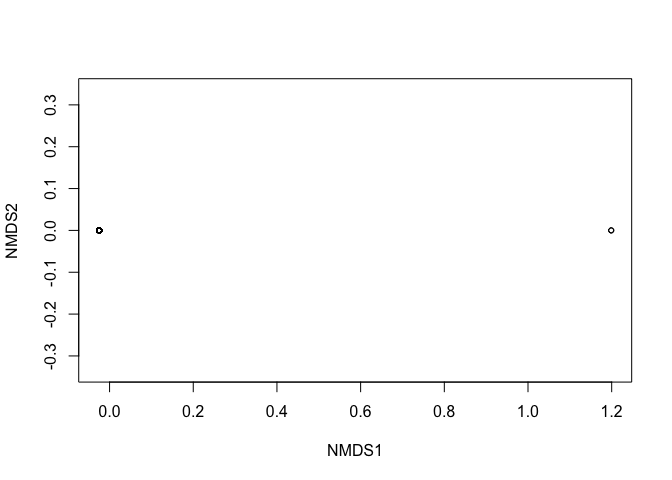
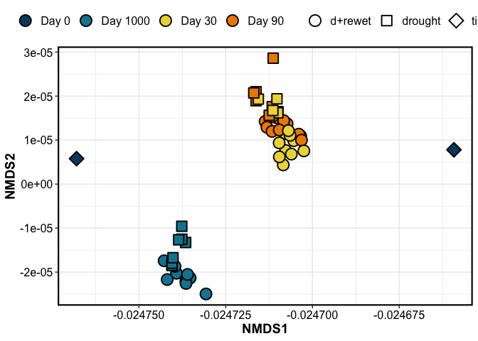
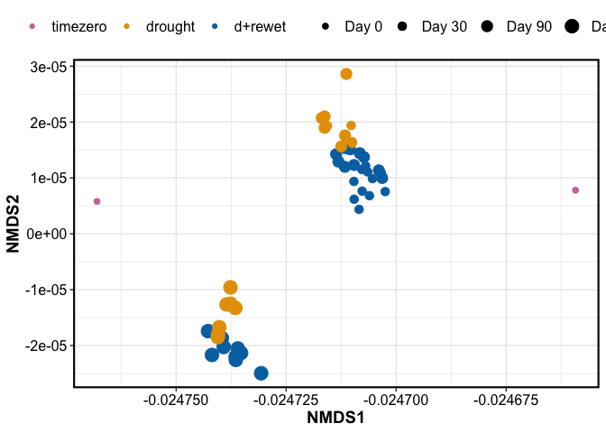
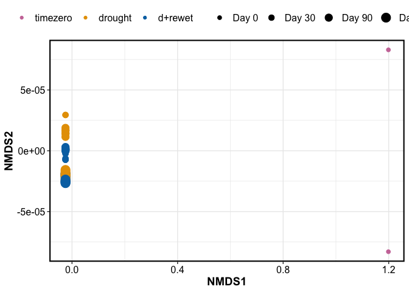
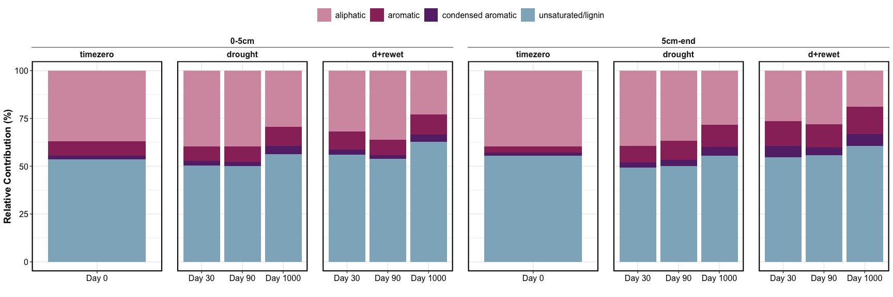
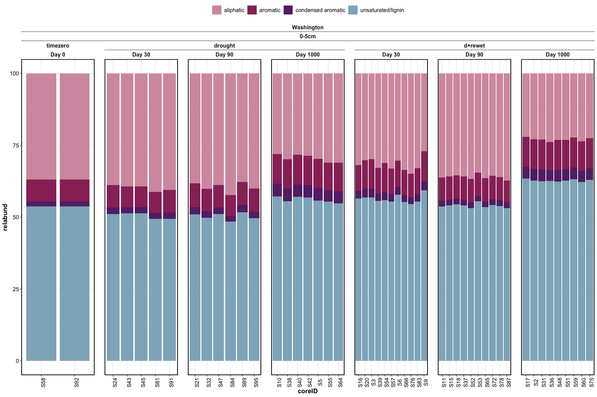
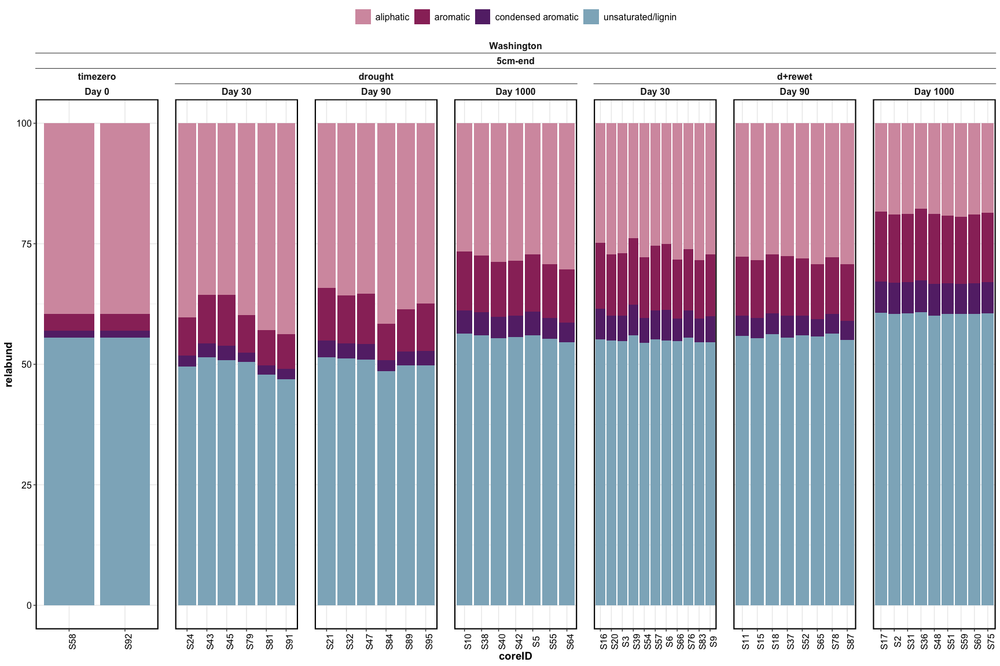

chemistry_report_NEW
================

------------------------------------------------------------------------

## FTICR

### Stats – PERMANOVA

    ## [1] "FTICR -- including top and bottom depths"

| term       |  df |  SumOfSqs |        R2 |  statistic | p.value |
|:-----------|----:|----------:|----------:|-----------:|--------:|
| depth      |   1 | 0.0506674 | 0.1149601 |  88.057141 |   0.001 |
| length     |   2 | 0.2056311 | 0.4665603 | 178.687892 |   0.001 |
| saturation |   1 | 0.1540093 | 0.3494347 | 267.659890 |   0.001 |
| drying     |   1 | 0.0018533 | 0.0042049 |   3.220881 |   0.083 |
| Residual   |  89 | 0.0512099 | 0.1161911 |         NA |      NA |
| Total      |  94 | 0.4407384 | 1.0000000 |         NA |      NA |

    ## [1] "FTICR -- including top depth only"

| term       |  df |  SumOfSqs |        R2 |   statistic | p.value |
|:-----------|----:|----------:|----------:|------------:|--------:|
| length     |   2 | 0.1219450 | 0.7254832 | 189.9259569 |   0.001 |
| saturation |   1 | 0.0420732 | 0.2503049 | 131.0558189 |   0.001 |
| drying     |   1 | 0.0000653 | 0.0003882 |   0.2032546 |   0.680 |
| Residual   |  43 | 0.0138044 | 0.0821262 |          NA |      NA |
| Total      |  47 | 0.1680880 | 1.0000000 |          NA |      NA |

### Stats – Clustering and NMDS — formula

ignoring compound classes, doing clustering/NMDS based on individual
molecules (presence/absence)

    ## 
    ## Call:
    ## metaMDS(comm = jacc, k = 3) 
    ## 
    ## global Multidimensional Scaling using monoMDS
    ## 
    ## Data:     jacc 
    ## Distance: jaccard 
    ## 
    ## Dimensions: 3 
    ## Stress:     2.562803e-05 
    ## Stress type 1, weak ties
    ## Best solution was repeated 6 times in 20 tries
    ## The best solution was from try 15 (random start)
    ## Scaling: centring, PC rotation, halfchange scaling 
    ## Species: scores missing

<!-- --><!-- -->

FTICR NMDS plots:

    ## [1] "color by length"

<!-- -->

    ## [1] "color by saturation - top"

<!-- -->

    ## [1] "color by saturation - bottom"

<!-- -->

### Relative abundance

<!-- -->

Click for relabund per core

<!-- --><!-- -->

------------------------------------------------------------------------
