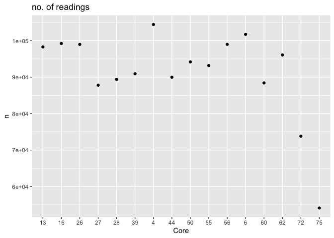

Drydown - Fluxes
================

Run: 2020-04-20

# 1\. PICARRO DATA

## negative fluxes removed

## initial plots, QA, QC

1.  number of readings

<!-- -->

2.  plotting by Core\_assignment

<!-- -->
