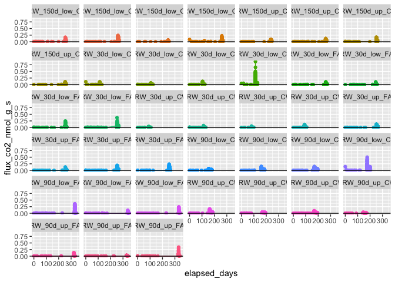

Drydown - Fluxes
================

Run: 2020-05-18

# 1\. PICARRO DATA – CPCRW

### individual cores

<!-- -->

### by treatment

<!-- -->

<!-- -->

# 1\. PICARRO DATA – SR

### individual cores

<!-- -->

### by treatment

<!-- -->

<!-- -->
