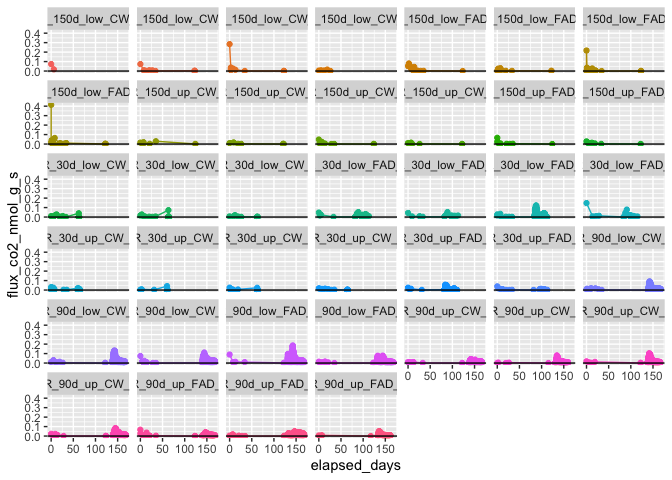
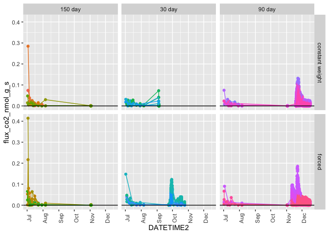

Drydown - Fluxes
================

Run: 2020-06-05

# 1\. PICARRO DATA – CPCRW

### individual cores

<!-- -->

<!-- -->

<!-- -->

### tables – by core

CO2: nmol\_g\_s

| Core | Core\_assignment         | drying          | length  |   drydown |   drought |       sat | sat\_incubation |
| ---: | :----------------------- | :-------------- | :------ | --------: | --------: | --------: | --------------: |
|    4 | CPCRW\_150d\_up\_CW\_r4  | constant weight | 150 day | 0.0003634 | 0.0014278 | 0.0157792 |       0.0493850 |
|   13 | CPCRW\_150d\_up\_CW\_r2  | constant weight | 150 day | 0.0012432 | 0.0012068 | 0.0215297 |       0.0436993 |
|   26 | CPCRW\_150d\_up\_CW\_r3  | constant weight | 150 day | 0.0024930 | 0.0008650 | 0.0684338 |       0.0728699 |
|   28 | CPCRW\_150d\_up\_CW\_r1  | constant weight | 150 day | 0.0004290 | 0.0009010 | 0.0280783 |       0.0375136 |
|   55 | CPCRW\_150d\_low\_CW\_r4 | constant weight | 150 day | 0.0123503 | 0.0057401 | 0.0399108 |       0.0818176 |
|   60 | CPCRW\_150d\_low\_CW\_r1 | constant weight | 150 day | 0.0030235 | 0.0023777 | 0.0325893 |       0.0641051 |
|   62 | CPCRW\_150d\_low\_CW\_r2 | constant weight | 150 day | 0.0012104 | 0.0019062 | 0.0621325 |       0.1056943 |
|   72 | CPCRW\_150d\_low\_CW\_r3 | constant weight | 150 day | 0.0004615 | 0.0008534 | 0.0210837 |       0.0171802 |
|    3 | CPCRW\_30d\_up\_CW\_r4   | constant weight | 30 day  | 0.0004878 | 0.0006763 | 0.0503415 |       0.0111161 |
|    9 | CPCRW\_30d\_up\_CW\_r2   | constant weight | 30 day  | 0.0016600 | 0.0001745 | 0.0207789 |       0.0028003 |
|   20 | CPCRW\_30d\_up\_CW\_r3   | constant weight | 30 day  | 0.0007709 | 0.0001734 | 0.0140033 |       0.0021965 |
|   54 | CPCRW\_30d\_low\_CW\_r4  | constant weight | 30 day  | 0.0217253 | 0.0003741 | 0.2295354 |       0.0245922 |
|   65 | CPCRW\_30d\_low\_CW\_r3  | constant weight | 30 day  | 0.0013400 | 0.0015481 | 0.0505235 |       0.0052149 |
|   66 | CPCRW\_30d\_low\_CW\_r2  | constant weight | 30 day  | 0.0016848 | 0.0010801 | 0.0184695 |       0.0074627 |
|   69 | CPCRW\_30d\_low\_CW\_r1  | constant weight | 30 day  | 0.0127141 | 0.0004011 | 0.0325916 |       0.0024441 |
|   82 | CPCRW\_30d\_up\_CW\_r1   | constant weight | 30 day  | 0.0001829 | 0.0001750 | 0.0123482 |       0.0018689 |
|    6 | CPCRW\_30d\_up\_FAD\_r1  | forced          | 30 day  | 0.0010543 | 0.0003899 | 0.0457505 |       0.0367173 |
|   16 | CPCRW\_30d\_up\_FAD\_r2  | forced          | 30 day  | 0.0012021 | 0.0023528 | 0.0105735 |       0.0408560 |
|   27 | CPCRW\_30d\_up\_FAD\_r3  | forced          | 30 day  | 0.0021623 | 0.0016809 | 0.0522078 |       0.0462512 |
|   39 | CPCRW\_30d\_up\_FAD\_r4  | forced          | 30 day  | 0.0014786 | 0.0000000 | 0.0657608 |       0.0763462 |
|   44 | CPCRW\_30d\_low\_FAD\_r3 | forced          | 30 day  | 0.0024380 | 0.0070102 | 0.0340760 |       0.0545602 |
|   50 | CPCRW\_30d\_low\_FAD\_r1 | forced          | 30 day  | 0.0014407 | 0.0001487 | 0.0175219 |       0.0255058 |
|   56 | CPCRW\_30d\_low\_FAD\_r4 | forced          | 30 day  | 0.0034783 | 0.0288417 | 0.0652527 |       0.0770335 |
|   75 | CPCRW\_30d\_low\_FAD\_r2 | forced          | 30 day  | 0.0003492 | 0.0011522 | 0.0031169 |       0.0176387 |
|   11 | CPCRW\_90d\_up\_CW\_r1   | constant weight | 90 day  | 0.0010552 | 0.0388795 | 0.0456278 |       0.0369977 |
|   15 | CPCRW\_90d\_up\_CW\_r2   | constant weight | 90 day  | 0.0024447 | 0.0195779 | 0.0202865 |       0.0158044 |
|   25 | CPCRW\_90d\_up\_CW\_r4   | constant weight | 90 day  | 0.0003448 | 0.0134471 | 0.0157208 |       0.0065307 |
|   34 | CPCRW\_90d\_up\_CW\_r3   | constant weight | 90 day  | 0.0006795 | 0.0385814 | 0.0459702 |       0.0182782 |
|   53 | CPCRW\_90d\_low\_CW\_r4  | constant weight | 90 day  | 0.0210307 | 0.1193886 | 0.1399417 |       0.0568124 |
|   61 | CPCRW\_90d\_low\_CW\_r2  | constant weight | 90 day  | 0.0006184 | 0.0305527 | 0.0336074 |       0.0277897 |
|   64 | CPCRW\_90d\_low\_CW\_r3  | constant weight | 90 day  | 0.0007403 | 0.0374197 | 0.0445990 |       0.0430868 |
|   86 | CPCRW\_90d\_low\_CW\_r1  | constant weight | 90 day  | 0.0008207 | 0.0200567 | 0.0236808 |       0.0215712 |
|    1 | CPCRW\_90d\_up\_FAD\_r1  | forced          | 90 day  | 0.0016607 | 0.0043124 | 0.0144351 |              NA |
|   18 | CPCRW\_90d\_up\_FAD\_r3  | forced          | 90 day  | 0.0010847 | 0.0005176 | 0.0048511 |              NA |
|   37 | CPCRW\_90d\_up\_FAD\_r4  | forced          | 90 day  | 0.0024316 | 0.0012539 | 0.0228140 |              NA |
|   52 | CPCRW\_90d\_low\_FAD\_r3 | forced          | 90 day  | 0.0023530 | 0.0018695 | 0.0087004 |              NA |
|   71 | CPCRW\_90d\_low\_FAD\_r4 | forced          | 90 day  | 0.0015713 | 0.0024111 | 0.0186221 |              NA |
|   77 | CPCRW\_90d\_low\_FAD\_r1 | forced          | 90 day  | 0.0032768 | 0.0010954 | 0.0391253 |              NA |

### tables – by treatment

CO2: nmol\_g\_s

| drying          | length  |   drydown |   drought |       sat | sat\_incubation |
| :-------------- | :------ | --------: | --------: | --------: | --------------: |
| constant weight | 150 day | 0.0026968 | 0.0019097 | 0.0361922 |       0.0590331 |
| constant weight | 30 day  | 0.0050707 | 0.0005753 | 0.0535740 |       0.0072120 |
| forced          | 30 day  | 0.0017004 | 0.0051971 | 0.0367825 |       0.0468636 |
| constant weight | 90 day  | 0.0034668 | 0.0397379 | 0.0461793 |       0.0283589 |
| forced          | 90 day  | 0.0020630 | 0.0019100 | 0.0180914 |              NA |

### by treatment

<!-- -->

<!-- -->

# 1\. PICARRO DATA – SR

### individual cores

<!-- -->

### by treatment

<!-- -->

<!-- -->
