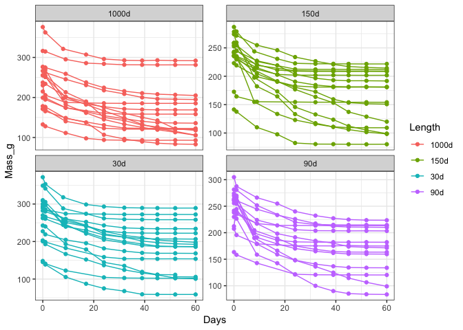

<!-- README.md is generated from README.Rmd. Please edit that file -->
TES-drydown
===========

    #> geom_path: Each group consists of only one observation. Do you need to
    #> adjust the group aesthetic?

