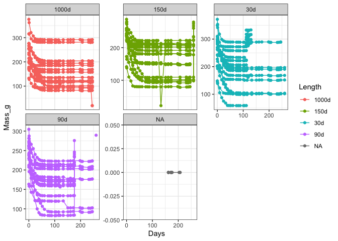
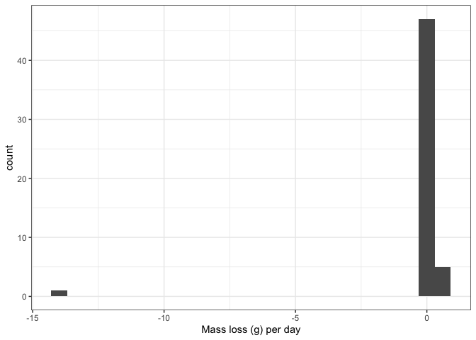

<!-- README.md is generated from README.Rmd. Please edit that file -->

# TES-drydown

Run: 2020-04-20

    #> Warning: Removed 35 rows containing missing values (geom_point).
    #> Warning: Removed 26 row(s) containing missing values (geom_path).

<!-- -->

    #>      Min.   1st Qu.    Median      Mean   3rd Qu.      Max.      NA's 
    #> -14.02000   0.08067   0.15143       Inf   0.26429       Inf        47

Currently cores’ median mass change is NA g/day:

    #> Warning: Removed 55 rows containing non-finite values (stat_bin).

<!-- -->

    #> # A tibble: 108 x 4
    #> # Groups:   Core [63]
    #>     Date                Core  Mass_g    change
    #>     <dttm>              <chr>  <dbl>     <dbl>
    #>   1 2019-08-19 00:00:00 26.0   232.  Inf      
    #>   2 2019-08-19 00:00:00 72.0   278.  Inf      
    #>   3 2019-08-19 00:00:00 28.0   266.  Inf      
    #>   4 2019-08-19 00:00:00 62.0   205.  Inf      
    #>   5 2019-08-19 00:00:00 55.0   224.  Inf      
    #>   6 2019-08-19 00:00:00 60.0   234.  Inf      
    #>   7 2019-08-19 00:00:00 13.0   260.  Inf      
    #>   8 2019-08-19 00:00:00 4.0    273.  Inf      
    #>   9 2019-08-05 00:00:00 54A     19.4 -14.0    
    #>  10 2019-04-12 00:00:00 3.0    316.    0.576  
    #>  11 2019-04-12 00:00:00 9.0    286.    0.514  
    #>  12 2019-04-12 00:00:00 66.0   288.    0.453  
    #>  13 2019-08-05 00:00:00 58.0   101.    0.35   
    #>  14 2019-04-12 00:00:00 54.0   170.    0.314  
    #>  15 2019-08-05 00:00:00 48.0   116.    0.281  
    #>  16 2019-04-12 00:00:00 65.0   286.    0.273  
    #>  17 2019-08-05 00:00:00 79.0    93.5   0.264  
    #>  18 2019-08-05 00:00:00 38.0   123.    0.229  
    #>  19 2019-08-05 00:00:00 59.0    97.4   0.224  
    #>  20 2019-08-05 00:00:00 51.0   136.    0.22   
    #>  21 2019-08-05 00:00:00 5.0    204.    0.203  
    #>  22 2019-08-05 00:00:00 77.0    92.7   0.196  
    #>  23 2019-08-05 00:00:00 46.0   150.    0.174  
    #>  24 2019-08-05 00:00:00 1.0    209.    0.173  
    #>  25 2019-08-05 00:00:00 63.0   169.    0.166  
    #>  26 2019-04-12 00:00:00 82.0   333.    0.164  
    #>  27 2019-08-05 00:00:00 74.0   292.    0.164  
    #>  28 2019-08-05 00:00:00 42.0    82.3   0.163  
    #>  29 2019-08-05 00:00:00 10.0   194.    0.16   
    #>  30 2019-08-05 00:00:00 2.0    281.    0.160  
    #>  31 2019-04-12 00:00:00 20.0   317.    0.154  
    #>  32 2019-08-05 00:00:00 40.0   120.    0.151  
    #>  33 2019-08-05 00:00:00 52.0   223.    0.149  
    #>  34 2019-08-05 00:00:00 18.0   203.    0.143  
    #>  35 2019-04-12 00:00:00 69.0   298.    0.141  
    #>  36 2019-08-05 00:00:00 17.0    93     0.14   
    #>  37 2019-08-05 00:00:00 37.0   102.    0.131  
    #>  38 2019-08-05 00:00:00 8.0    207.    0.131  
    #>  39 2019-08-05 00:00:00 14.0   181.    0.12   
    #>  40 2019-08-05 00:00:00 71.0   177.    0.117  
    #>  41 2019-08-05 00:00:00 85.0   202.    0.116  
    #>  42 2019-08-05 00:00:00 31.0   185.    0.113  
    #>  43 2019-08-05 00:00:00 36.0   158.    0.109  
    #>  44 2019-08-05 00:00:00 49.0    80.1   0.101  
    #>  45 2019-08-05 00:00:00 33.0   213.    0.0986 
    #>  46 2019-08-05 00:00:00 35.0   148.    0.0857 
    #>  47 2019-08-20 00:00:00 56.0   104.    0.0807 
    #>  48 2019-08-19 00:00:00 60.0   102.    0.0514 
    #>  49 2019-08-19 00:00:00 55.0    97.9   0.0429 
    #>  50 2019-08-20 00:00:00 44.0   102.    0.0393 
    #>  51 2019-08-20 00:00:00 50.0   191.    0.0360 
    #>  52 2019-08-20 00:00:00 39.0   102.    0.028  
    #>  53 2019-08-20 00:00:00 6.0    197.    0.0227 
    #>  54 2019-08-19 00:00:00 62.0   110.    0.0214 
    #>  55 2019-08-19 00:00:00 13.0   192.    0.0193 
    #>  56 2019-08-20 00:00:00 16.0   168.    0.0187 
    #>  57 2019-08-20 00:00:00 27.0   152.    0.0133 
    #>  58 2019-08-19 00:00:00 4.0    209.    0.0129 
    #>  59 2019-08-19 00:00:00 26.0   178.    0.0121 
    #>  60 2019-08-19 00:00:00 72.0   222.    0.0121 
    #>  61 2019-08-19 00:00:00 28.0   209.    0.01000
    #>  62 2019-05-29 00:00:00 61.0    NA    NA      
    #>  63 2019-06-24 00:00:00 86.0    NA    NA      
    #>  64 2019-06-24 00:00:00 11.0    NA    NA      
    #>  65 2019-06-24 00:00:00 25.0    NA    NA      
    #>  66 2019-06-24 00:00:00 34.0    NA    NA      
    #>  67 2019-06-24 00:00:00 64.0    NA    NA      
    #>  68 2019-06-24 00:00:00 53.0    NA    NA      
    #>  69 2019-08-20 00:00:00 0.0     NA    NA      
    #>  70 2019-08-20 00:00:00 15.0   289.   NA      
    #>  71 2019-08-20 00:00:00 27.0    NA    NA      
    #>  72 2019-08-20 00:00:00 6.0     NA    NA      
    #>  73 2019-08-20 00:00:00 39.0    NA    NA      
    #>  74 2019-08-20 00:00:00 44.0    NA    NA      
    #>  75 2019-08-20 00:00:00 16.0    NA    NA      
    #>  76 2019-08-20 00:00:00 56.0    NA    NA      
    #>  77 2019-08-20 00:00:00 75.0    NA    NA      
    #>  78 2019-08-20 00:00:00 50.0    NA    NA      
    #>  79 2019-08-05 00:00:00 33.0   213.  NaN      
    #>  80 2019-08-05 00:00:00 59.0    97.4 NaN      
    #>  81 2019-08-05 00:00:00 71.0   177.  NaN      
    #>  82 2019-08-05 00:00:00 77.0    92.7 NaN      
    #>  83 2019-08-05 00:00:00 42.0    82.3 NaN      
    #>  84 2019-08-05 00:00:00 40.0   120.  NaN      
    #>  85 2019-08-05 00:00:00 49.0    80.1 NaN      
    #>  86 2019-08-05 00:00:00 18.0   203.  NaN      
    #>  87 2019-08-05 00:00:00 52.0   223.  NaN      
    #>  88 2019-08-05 00:00:00 14.0   181.  NaN      
    #>  89 2019-08-05 00:00:00 37.0   102.  NaN      
    #>  90 2019-08-05 00:00:00 1.0    209.  NaN      
    #>  91 2019-08-05 00:00:00 85.0   202.  NaN      
    #>  92 2019-08-05 00:00:00 17.0    93   NaN      
    #>  93 2019-08-05 00:00:00 46.0   150.  NaN      
    #>  94 2019-08-05 00:00:00 8.0    207.  NaN      
    #>  95 2019-08-05 00:00:00 10.0   194.  NaN      
    #>  96 2019-08-05 00:00:00 35.0   148.  NaN      
    #>  97 2019-08-05 00:00:00 63.0   169.  NaN      
    #>  98 2019-08-05 00:00:00 36.0   158.  NaN      
    #>  99 2019-08-05 00:00:00 79.0    93.5 NaN      
    #> 100 2019-08-05 00:00:00 74.0   292.  NaN      
    #> # … with 8 more rows
