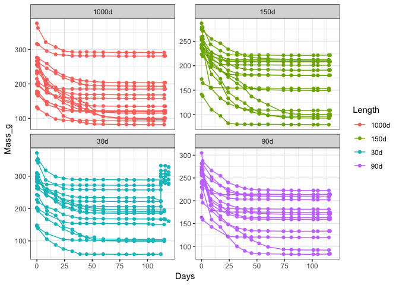
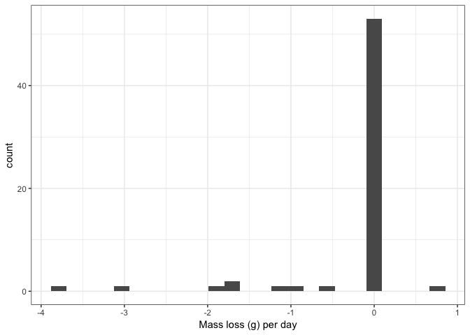

<!-- README.md is generated from README.Rmd. Please edit that file -->
TES-drydown
===========

Run: 2019-04-03

    #> Warning: Removed 7 rows containing missing values (geom_point).

    #>     Min.  1st Qu.   Median     Mean  3rd Qu.     Max. 
    #> -3.79667 -0.00575  0.00100 -0.21917  0.02000  0.75000

Currently cores' median mass change is 0 g/day:

    #> # A tibble: 62 x 4
    #> # Groups:   Core [62]
    #>    Date                Core  Mass_g    change
    #>    <dttm>              <chr>  <dbl>     <dbl>
    #>  1 2019-04-01 00:00:00 66     275.  -3.80    
    #>  2 2019-04-01 00:00:00 69     290.  -3.07    
    #>  3 2019-04-01 00:00:00 54     161.  -1.86    
    #>  4 2019-04-01 00:00:00 20     312.  -1.74    
    #>  5 2019-04-01 00:00:00 65     278.  -1.67    
    #>  6 2019-04-01 00:00:00 82     329.  -1.20    
    #>  7 2019-04-01 00:00:00 3      304.  -0.99    
    #>  8 2019-03-29 00:00:00 53      83.8  0.75    
    #>  9 2019-04-01 00:00:00 9      277.  -0.63    
    #> 10 2019-03-29 00:00:00 55      97.0  0.0800  
    #> 11 2019-03-29 00:00:00 48     115.   0.06    
    #> 12 2019-03-29 00:00:00 5      204.   0.06    
    #> 13 2019-03-29 00:00:00 13     191.   0.05    
    #> 14 2019-03-29 00:00:00 60     101.   0.04    
    #> 15 2019-03-29 00:00:00 58     100.   0.0400  
    #> 16 2019-03-29 00:00:00 62     109.   0.0400  
    #> 17 2019-03-29 00:00:00 64     163.   0.0400  
    #> 18 2019-03-29 00:00:00 38     122.   0.03    
    #> 19 2019-03-29 00:00:00 61     134.   0.03    
    #> 20 2019-03-29 00:00:00 86     213.   0.0300  
    #> 21 2019-03-29 00:00:00 2      281.   0.0300  
    #> 22 2019-03-29 00:00:00 26     181.   0.02    
    #> 23 2019-03-29 00:00:00 4      208.   0.02    
    #> 24 2019-03-29 00:00:00 51     135.   0.02    
    #> 25 2019-03-29 00:00:00 54A    119.   0.02    
    #> 26 2019-03-29 00:00:00 25     214.   0.0200  
    #> 27 2019-03-29 00:00:00 34     175.   0.0200  
    #> 28 2019-03-28 00:00:00 79      92.8 -0.0110  
    #> 29 2019-03-29 00:00:00 15     159.  -0.01    
    #> 30 2019-03-28 00:00:00 14     180.   0.01000 
    #> 31 2019-03-29 00:00:00 11     171.  -0.01000 
    #> 32 2019-03-29 00:00:00 72     222.   0.01000 
    #> 33 2019-03-29 00:00:00 31     185.   0.01000 
    #> 34 2019-03-28 00:00:00 8      212.  -0.008   
    #> 35 2019-03-28 00:00:00 33     211.   0.008   
    #> 36 2019-03-28 00:00:00 40     120.  -0.00800 
    #> 37 2019-03-28 00:00:00 75     288.   0.007   
    #> 38 2019-03-28 00:00:00 6      196.  -0.00700 
    #> 39 2019-03-28 00:00:00 10     193.  -0.00700 
    #> 40 2019-03-28 00:00:00 59      96.6 -0.006   
    #> 41 2019-03-28 00:00:00 17      92.4  0.006   
    #> 42 2019-03-28 00:00:00 44      98.9  0.006   
    #> 43 2019-03-28 00:00:00 16     168.  -0.005   
    #> 44 2019-03-28 00:00:00 1      209.  -0.00500 
    #> 45 2019-03-28 00:00:00 46     150.  -0.004   
    #> 46 2019-03-28 00:00:00 56     104.   0.004   
    #> 47 2019-03-28 00:00:00 74     291.  -0.003   
    #> 48 2019-03-28 00:00:00 36     158.  -0.003   
    #> 49 2019-03-28 00:00:00 77      91.9 -0.003   
    #> 50 2019-03-28 00:00:00 18     202.  -0.002   
    #> 51 2019-03-28 00:00:00 27     151.   0.002   
    #> 52 2019-03-28 00:00:00 39     101.  -0.002   
    #> 53 2019-03-28 00:00:00 50     191.  -0.002   
    #> 54 2019-03-28 00:00:00 49      79.6 -0.00200 
    #> 55 2019-03-28 00:00:00 42      81.7 -0.00200 
    #> 56 2019-03-28 00:00:00 71     181.   0.00200 
    #> 57 2019-03-28 00:00:00 37     120.  -0.001   
    #> 58 2019-03-28 00:00:00 85     201.   0.001000
    #> 59 2019-03-28 00:00:00 63     168.   0.001000
    #> 60 2019-03-28 00:00:00 35     154.   0.001000
    #> 61 2019-03-28 00:00:00 52     223.   0.001000
    #> 62 2019-03-29 00:00:00 28     209.   0
