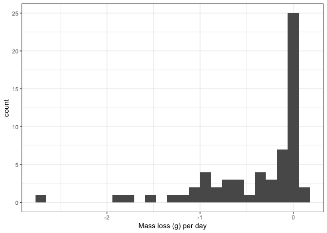

<!-- README.md is generated from README.Rmd. Please edit that file -->
TES-drydown
===========

    #>     Min.  1st Qu.   Median     Mean  3rd Qu.     Max. 
    #> -1.17733 -0.08656 -0.02312 -0.13457 -0.01312  0.01625

Currently cores' median mass change is 0 g/day:

