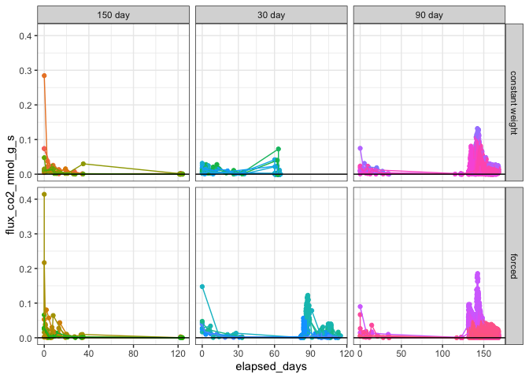
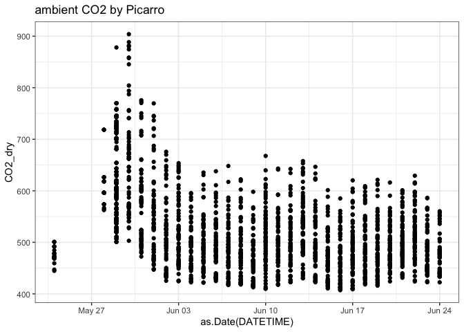

Drydown - Fluxes
================

CO2 concentrations and/or fluxes from the Picarro and EGM-4.

# 1\. PICARRO DATA – CPCRW

<!-- -->

time-series by treatment

<!-- -->

<!-- -->

individual cores

<!-- -->

<!-- -->

### tables – by core

(hidden)

### tables – by treatment

CO2: nmol\_g\_s

| drying          | length  |   drydown |   drought |       sat | sat\_incubation |
| :-------------- | :------ | --------: | --------: | --------: | --------------: |
| constant weight | 150 day | 0.0026968 | 0.0019097 | 0.0361922 |       0.0590331 |
| constant weight | 30 day  | 0.0050707 | 0.0005753 | 0.0535740 |       0.0072120 |
| forced          | 30 day  | 0.0017004 | 0.0051971 | 0.0367825 |       0.0468636 |
| constant weight | 90 day  | 0.0034668 | 0.0397379 | 0.0461793 |       0.0283589 |
| forced          | 90 day  | 0.0020630 | 0.0019100 | 0.0180914 |              NA |

# 2\. PICARRO DATA – SR

<!-- -->

time-series by treatment

<!-- -->

<!-- -->

individual cores

<!-- -->

<!-- -->

### tables – by core

(hidden)

### tables – by treatment

CO2: nmol\_g\_s

| drying          | length  |   initial |   drydown |   drought |       sat | sat\_incubation |
| :-------------- | :------ | --------: | --------: | --------: | --------: | --------------: |
| constant weight | 150 day | 0.0989391 | 0.0105981 | 0.0021861 |        NA |              NA |
| forced          | 150 day | 0.1461563 | 0.0131859 | 0.0022645 |        NA |              NA |
| constant weight | 30 day  | 0.0220704 | 0.0090548 | 0.0018005 | 0.0013462 |              NA |
| forced          | 30 day  | 0.1477050 | 0.0165348 | 0.0013383 | 0.0296432 |       0.0127297 |
| constant weight | 90 day  | 0.0353427 | 0.0088140 | 0.0012004 | 0.0175935 |              NA |
| forced          | 90 day  | 0.0388691 | 0.0088061 | 0.0171287 | 0.0154657 |              NA |

-----

# 3\. EGM DATA – CO2 concentrations

## ambient CO2

<!-- -->

## all cores

<!-- --><!-- -->

# PICARRO CONCENTRATIONS

<!-- --><!-- -->

<!-- -->

<!-- --><!-- -->
