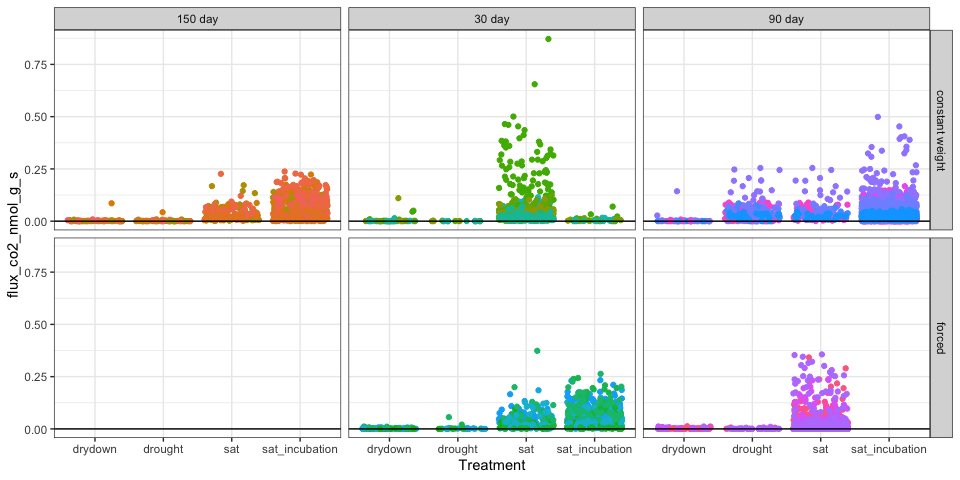
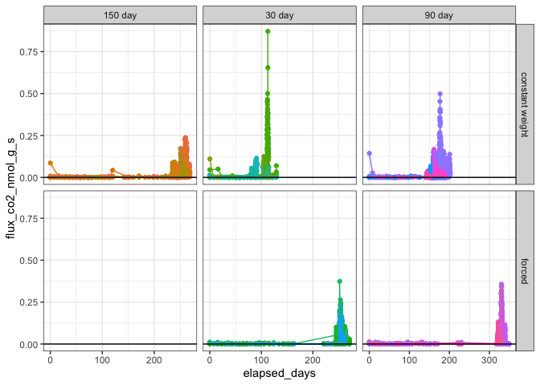
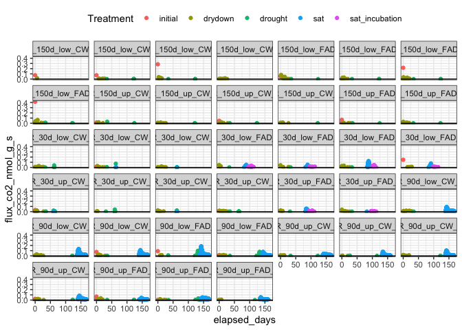
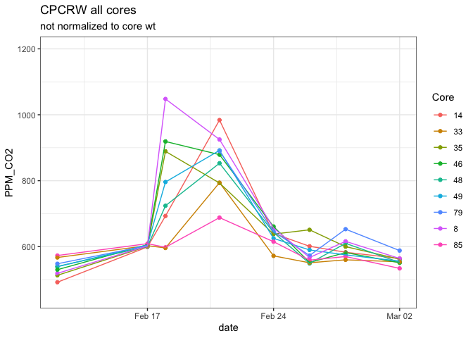
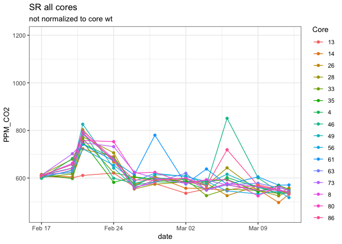

Drydown - Fluxes
================

CO2 concentrations and/or fluxes from the Picarro and EGM-4.

# 1\. PICARRO DATA – CPCRW

<!-- -->

time-series by treatment

<!-- -->

<!-- -->

individual cores

<!-- -->

<!-- -->

### tables – by core

(hidden)

### tables – by treatment

CO2: nmol\_g\_s

| drying          | length  |   drydown |   drought |       sat | sat\_incubation |
| :-------------- | :------ | --------: | --------: | --------: | --------------: |
| constant weight | 150 day | 0.0026968 | 0.0019097 | 0.0361922 |       0.0590331 |
| constant weight | 30 day  | 0.0050707 | 0.0005753 | 0.0535740 |       0.0072120 |
| forced          | 30 day  | 0.0017004 | 0.0051971 | 0.0367825 |       0.0468636 |
| constant weight | 90 day  | 0.0034668 | 0.0397379 | 0.0461793 |       0.0283589 |
| forced          | 90 day  | 0.0020630 | 0.0019100 | 0.0180914 |              NA |

# 2\. PICARRO DATA – SR

<!-- -->

time-series by treatment

<!-- -->

<!-- -->

individual cores

<!-- -->

<!-- -->

### tables – by core

(hidden)

### tables – by treatment

CO2: nmol\_g\_s

| drying          | length  |   initial |   drydown |   drought |       sat | sat\_incubation |
| :-------------- | :------ | --------: | --------: | --------: | --------: | --------------: |
| constant weight | 150 day | 0.0989391 | 0.0105981 | 0.0021861 |        NA |              NA |
| forced          | 150 day | 0.1461563 | 0.0131859 | 0.0022645 |        NA |              NA |
| constant weight | 30 day  | 0.0220704 | 0.0090548 | 0.0018005 | 0.0013462 |              NA |
| forced          | 30 day  | 0.1477050 | 0.0165348 | 0.0013383 | 0.0296432 |       0.0127297 |
| constant weight | 90 day  | 0.0353427 | 0.0088140 | 0.0012004 | 0.0175935 |              NA |
| forced          | 90 day  | 0.0388691 | 0.0088061 | 0.0171287 | 0.0154657 |              NA |

-----

# 3\. EGM DATA – CO2 concentrations

## ambient CO2

<!-- -->

## all cores

<!-- --><!-- -->

<!-- -->

-----

Session Info

Date Run: 2020-07-24

    #> R version 4.0.2 (2020-06-22)
    #> Platform: x86_64-apple-darwin17.0 (64-bit)
    #> Running under: macOS Catalina 10.15.6
    #> 
    #> Matrix products: default
    #> BLAS:   /Library/Frameworks/R.framework/Versions/4.0/Resources/lib/libRblas.dylib
    #> LAPACK: /Library/Frameworks/R.framework/Versions/4.0/Resources/lib/libRlapack.dylib
    #> 
    #> locale:
    #> [1] en_US.UTF-8/en_US.UTF-8/en_US.UTF-8/C/en_US.UTF-8/en_US.UTF-8
    #> 
    #> attached base packages:
    #> [1] stats     graphics  grDevices utils     datasets  methods   base     
    #> 
    #> other attached packages:
    #>  [1] picarro.data_0.1.1 forcats_0.5.0      stringr_1.4.0      dplyr_1.0.0       
    #>  [5] purrr_0.3.4        readr_1.3.1        tidyr_1.1.0        tibble_3.0.3      
    #>  [9] tidyverse_1.3.0    drake_7.12.4       multcomp_1.4-13    TH.data_1.0-10    
    #> [13] MASS_7.3-51.6      survival_3.1-12    mvtnorm_1.1-1      agricolae_1.3-3   
    #> [17] car_3.0-8          carData_3.0-4      nlme_3.1-148       stringi_1.4.6     
    #> [21] ggExtra_0.9        ggalt_0.4.0        ggplot2_3.3.2      knitr_1.29        
    #> [25] qwraps2_0.4.2      cowplot_1.0.0      data.table_1.12.8  luzlogr_0.2.0     
    #> [29] lubridate_1.7.9    readxl_1.3.1       here_0.1          
    #> 
    #> loaded via a namespace (and not attached):
    #>  [1] colorspace_1.4-1   ellipsis_0.3.1     rio_0.5.16         rprojroot_1.3-2   
    #>  [5] fs_1.4.2           rstudioapi_0.11    farver_2.0.3       fansi_0.4.1       
    #>  [9] xml2_1.3.2         codetools_0.2-16   splines_4.0.2      extrafont_0.17    
    #> [13] jsonlite_1.7.0     broom_0.7.0        Rttf2pt1_1.3.8     cluster_2.1.0     
    #> [17] dbplyr_1.4.4       shiny_1.5.0        httr_1.4.2         compiler_4.0.2    
    #> [21] backports_1.1.8    assertthat_0.2.1   Matrix_1.2-18      fastmap_1.0.1     
    #> [25] cli_2.0.2          later_1.1.0.1      htmltools_0.5.0    prettyunits_1.1.1 
    #> [29] tools_4.0.2        igraph_1.2.5       gtable_0.3.0       glue_1.4.1        
    #> [33] maps_3.3.0         Rcpp_1.0.5         cellranger_1.1.0   vctrs_0.3.2       
    #> [37] extrafontdb_1.0    xfun_0.15          rvest_0.3.5        openxlsx_4.1.5    
    #> [41] mime_0.9           miniUI_0.1.1.1     lifecycle_0.2.0    zoo_1.8-8         
    #> [45] scales_1.1.1       hms_0.5.3          promises_1.1.1     parallel_4.0.2    
    #> [49] proj4_1.0-10       sandwich_2.5-1     RColorBrewer_1.1-2 yaml_2.2.1        
    #> [53] curl_4.3           labelled_2.5.0     highr_0.8          klaR_0.6-15       
    #> [57] AlgDesign_1.2.0    filelock_1.0.2     zip_2.0.4          storr_1.2.1       
    #> [61] rlang_0.4.7        pkgconfig_2.0.3    evaluate_0.14      lattice_0.20-41   
    #> [65] labeling_0.3       tidyselect_1.1.0   magrittr_1.5       R6_2.4.1          
    #> [69] generics_0.0.2     base64url_1.4      combinat_0.0-8     txtq_0.2.3        
    #> [73] DBI_1.1.0          pillar_1.4.6       haven_2.3.1        foreign_0.8-80    
    #> [77] withr_2.2.0        abind_1.4-5        ash_1.0-15         modelr_0.1.8      
    #> [81] crayon_1.3.4       questionr_0.7.1    KernSmooth_2.23-17 rmarkdown_2.3     
    #> [85] progress_1.2.2     grid_4.0.2         blob_1.2.1         reprex_0.3.0      
    #> [89] digest_0.6.25      xtable_1.8-4       httpuv_1.5.4       munsell_0.5.0

