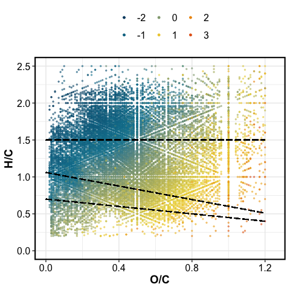
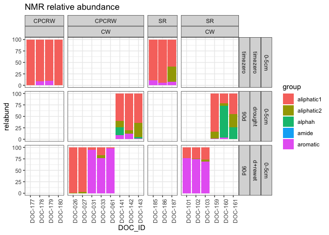

Part I: drying vs. rewetting
================

------------------------------------------------------------------------

RESEARCH QUESTIONS – click to open

------------------------------------------------------------------------

# FTICR

    #> $gg_vk_domains

<!-- -->

    #> 
    #> $gg_vk_domains_nosc

<!-- -->

<!-- -->

    #> $gg_pca_drying_vs_dw

<!-- -->

------------------------------------------------------------------------

# NMR

    #> $spectra_tzero

<!-- -->

    #> 
    #> $spectra_cpcrw

<!-- -->

    #> 
    #> $spectra_sr

<!-- -->

    #> $relabund_bar_cores

<!-- -->

    #> 
    #> $relabund_bar_top

<!-- -->

<!-- -->

    #> $permanova_tzero
    #> 
    #> Call:
    #> adonis(formula = rel_abund_wide %>% filter(length == "timezero") %>%      dplyr::select(aliphatic1, aliphatic2, aromatic, alphah, amide) ~      (Site)^2, data = rel_abund_wide %>% filter(length == "timezero")) 
    #> 
    #> Permutation: free
    #> Number of permutations: 5039
    #> 
    #> Terms added sequentially (first to last)
    #> 
    #>           Df SumsOfSqs  MeanSqs F.Model     R2 Pr(>F)
    #> Site       1  0.034751 0.034751  1.9367 0.2792  0.143
    #> Residuals  5  0.089715 0.017943         0.7208       
    #> Total      6  0.124466                  1.0000       
    #> 
    #> $permanova_drought_toponly
    #> 
    #> Call:
    #> adonis(formula = relabund_permanova %>% filter(depth == "0-5cm") %>%      dplyr::select(aliphatic1, aliphatic2, aromatic, alphah, amide) ~      (Site + saturation)^2, data = relabund_permanova %>% filter(depth ==      "0-5cm")) 
    #> 
    #> Permutation: free
    #> Number of permutations: 999
    #> 
    #> Terms added sequentially (first to last)
    #> 
    #>                 Df SumsOfSqs MeanSqs F.Model      R2 Pr(>F)  
    #> Site             1   0.11063 0.11063  0.8031 0.04317  0.391  
    #> saturation       1   1.02002 1.02002  7.4044 0.39803  0.016 *
    #> Site:saturation  1   0.05445 0.05445  0.3952 0.02125  0.664  
    #> Residuals       10   1.37758 0.13776         0.53756         
    #> Total           13   2.56267                 1.00000         
    #> ---
    #> Signif. codes:  0 '***' 0.001 '**' 0.01 '*' 0.05 '.' 0.1 ' ' 1

------------------------------------------------------------------------

# WEOC

<!-- -->

------------------------------------------------------------------------

# POM-nonPOM

<!-- -->

------------------------------------------------------------------------

# Microbiome

<!-- -->

<!-- -->

------------------------------------------------------------------------

------------------------------------------------------------------------

# Session Info

SESSION INFO – click to open

date run: 2022-01-03

    #> R version 4.1.1 (2021-08-10)
    #> Platform: x86_64-apple-darwin17.0 (64-bit)
    #> Running under: macOS Catalina 10.15.7
    #> 
    #> Matrix products: default
    #> BLAS:   /System/Library/Frameworks/Accelerate.framework/Versions/A/Frameworks/vecLib.framework/Versions/A/libBLAS.dylib
    #> LAPACK: /Library/Frameworks/R.framework/Versions/4.1/Resources/lib/libRlapack.dylib
    #> 
    #> locale:
    #> [1] en_US.UTF-8/en_US.UTF-8/en_US.UTF-8/C/en_US.UTF-8/en_US.UTF-8
    #> 
    #> attached base packages:
    #> [1] stats     graphics  grDevices utils     datasets  methods   base     
    #> 
    #> other attached packages:
    #>  [1] googlesheets4_1.0.0 patchwork_1.1.1     soilpalettes_0.1.0  PNWColors_0.1.0    
    #>  [5] ape_5.5             microbiome_1.14.0   pairwiseAdonis_0.4  cluster_2.1.2      
    #>  [9] phyloseq_1.36.0     microViz_0.7.2      devtools_2.4.2      usethis_2.1.3      
    #> [13] vegan_2.5-7         lattice_0.20-44     permute_0.9-5       GUniFrac_1.4       
    #> [17] RColorBrewer_1.1-2  data.table_1.14.2   funrar_1.4.1        picarro.data_0.1.1 
    #> [21] forcats_0.5.1       stringr_1.4.0       dplyr_1.0.7         purrr_0.3.4        
    #> [25] readr_2.0.2         tidyr_1.1.4         tibble_3.1.5        tidyverse_1.3.1    
    #> [29] drake_7.13.2        ggbiplot_0.55       agricolae_1.3-5     car_3.0-11         
    #> [33] carData_3.0-4       nlme_3.1-153        stringi_1.7.5       ggExtra_0.9        
    #> [37] ggalt_0.4.0         ggplot2_3.3.5       lubridate_1.8.0     readxl_1.3.1       
    #> 
    #> loaded via a namespace (and not attached):
    #>   [1] utf8_1.2.2             questionr_0.7.4        tidyselect_1.1.1      
    #>   [4] lme4_1.1-27.1          grid_4.1.1             combinat_0.0-8        
    #>   [7] Rtsne_0.15             modeest_2.4.0          munsell_0.5.0         
    #>  [10] base64url_1.4          codetools_0.2-18       statmod_1.4.36        
    #>  [13] miniUI_0.1.1.1         withr_2.4.2            colorspace_2.0-2      
    #>  [16] Biobase_2.52.0         filelock_1.0.2         highr_0.9             
    #>  [19] knitr_1.36             AlgDesign_1.2.0        rstudioapi_0.13       
    #>  [22] stats4_4.1.1           Rttf2pt1_1.3.9         labeling_0.4.2        
    #>  [25] GenomeInfoDbData_1.2.6 bit64_4.0.5            farver_2.1.0          
    #>  [28] rhdf5_2.36.0           fBasics_3042.89.1      txtq_0.2.4            
    #>  [31] rprojroot_2.0.2        vctrs_0.3.8            generics_0.1.0        
    #>  [34] xfun_0.25              R6_2.5.1               GenomeInfoDb_1.28.4   
    #>  [37] clue_0.3-60            rhdf5filters_1.4.0     bitops_1.0-7          
    #>  [40] cachem_1.0.6           assertthat_0.2.1       vroom_1.5.4           
    #>  [43] promises_1.2.0.1       scales_1.1.1           gtable_0.3.0          
    #>  [46] ash_1.0-15             processx_3.5.2         spatial_7.3-14        
    #>  [49] timeDate_3043.102      rlang_0.4.11           splines_4.1.1         
    #>  [52] extrafontdb_1.0        gargle_1.2.0           broom_0.7.10          
    #>  [55] yaml_2.2.1             reshape2_1.4.4         abind_1.4-5           
    #>  [58] modelr_0.1.8           backports_1.2.1        httpuv_1.6.2          
    #>  [61] extrafont_0.17         tools_4.1.1            ellipsis_0.3.2        
    #>  [64] biomformat_1.20.0      BiocGenerics_0.38.0    stabledist_0.7-1      
    #>  [67] sessioninfo_1.1.1      Rcpp_1.0.7             plyr_1.8.6            
    #>  [70] zlibbioc_1.38.0        progress_1.2.2         RCurl_1.98-1.4        
    #>  [73] ps_1.6.0               prettyunits_1.1.1      openssl_1.4.4         
    #>  [76] rpart_4.1-15           cowplot_1.1.1          statip_0.2.3          
    #>  [79] S4Vectors_0.30.2       haven_2.4.3            ggrepel_0.9.1         
    #>  [82] fs_1.5.0               magrittr_2.0.1         timeSeries_3062.100   
    #>  [85] openxlsx_4.2.4         lmerTest_3.1-3         reprex_2.0.1          
    #>  [88] googledrive_2.0.0      storr_1.2.5            matrixStats_0.60.1    
    #>  [91] pkgload_1.2.1          hms_1.1.0              mime_0.11             
    #>  [94] evaluate_0.14          xtable_1.8-4           klaR_0.6-15           
    #>  [97] rio_0.5.27             IRanges_2.26.0         testthat_3.1.0        
    #> [100] compiler_4.1.1         maps_3.3.0             KernSmooth_2.23-20    
    #> [103] crayon_1.4.1           minqa_1.2.4            htmltools_0.5.2       
    #> [106] mgcv_1.8-36            later_1.3.0            tzdb_0.1.2            
    #> [109] DBI_1.1.1              rmutil_1.1.5           dbplyr_2.1.1          
    #> [112] proj4_1.0-10.1         rappdirs_0.3.3         MASS_7.3-54           
    #> [115] boot_1.3-28            ade4_1.7-18            Matrix_1.3-4          
    #> [118] cli_3.0.1              parallel_4.1.1         igraph_1.2.6          
    #> [121] pkgconfig_2.0.3        numDeriv_2016.8-1.1    foreign_0.8-81        
    #> [124] xml2_1.3.2             foreach_1.5.1          multtest_2.48.0       
    #> [127] XVector_0.32.0         rvest_1.0.1            callr_3.7.0           
    #> [130] digest_0.6.27          Biostrings_2.60.2      rmarkdown_2.11        
    #> [133] cellranger_1.1.0       curl_4.3.2             shiny_1.7.1           
    #> [136] nloptr_1.2.2.2         lifecycle_1.0.0        jsonlite_1.7.2        
    #> [139] Rhdf5lib_1.14.2        askpass_1.1            viridisLite_0.4.0     
    #> [142] desc_1.4.0             fansi_0.5.0            labelled_2.8.0        
    #> [145] pillar_1.6.2           survival_3.2-12        fastmap_1.1.0         
    #> [148] httr_1.4.2             pkgbuild_1.2.0         glue_1.4.2            
    #> [151] remotes_2.4.0          zip_2.2.0              iterators_1.0.13      
    #> [154] bit_4.0.4              stable_1.1.4           memoise_2.0.0

