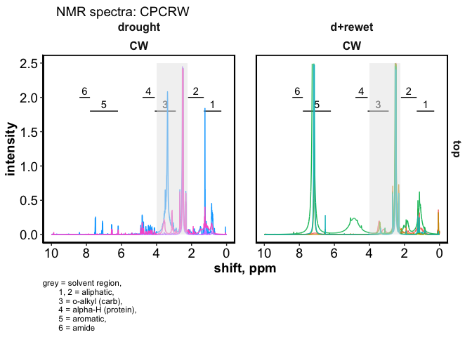

Part I: drying vs. rewetting
================

------------------------------------------------------------------------

RESEARCH QUESTIONS – click to open

------------------------------------------------------------------------

# FTICR

    #> $gg_vk_domains

<!-- -->

    #> 
    #> $gg_vk_domains_nosc

<!-- -->

<!-- -->

    #> $gg_pca_drying_vs_dw

<!-- -->

------------------------------------------------------------------------

# NMR

    #> $spectra_tzero

<!-- -->

    #> 
    #> $spectra_cpcrw

<!-- -->

    #> 
    #> $spectra_sr

<!-- -->

    #> $relabund_bar_cores

<!-- -->

    #> 
    #> $relabund_bar_top

<!-- -->

<!-- -->

    #> # A tibble: 5 × 7
    #>   term               df SumsOfSqs MeanSqs F.Model     R2 p.value
    #>   <chr>           <dbl>     <dbl>   <dbl>   <dbl>  <dbl>   <dbl>
    #> 1 Site                1    0.111   0.111    0.803 0.0432   0.391
    #> 2 saturation          1    1.02    1.02     7.40  0.398    0.016
    #> 3 Site:saturation     1    0.0544  0.0544   0.395 0.0212   0.664
    #> 4 Residuals          10    1.38    0.138   NA     0.538   NA    
    #> 5 Total              13    2.56   NA       NA     1       NA

------------------------------------------------------------------------

# WEOC

    #> $plot

<!-- -->

    #> 
    #> $table
    #> 
    #> 
    #> |Site       |depth  |timezero      |drought       |d+rewet       |
    #> |:----------|:------|:-------------|:-------------|:-------------|
    #> |Alaska     |top    |0.2 ± 0.11 a  |0.74 ± 0.49 a |0.69 ± 0.26 a |
    #> |Alaska     |bottom |0.06 ± 0.01 a |0.2 ± 0.11 a  |0.15 ± 0.05 a |
    #> |Washington |top    |0.05 ± 0.01 c |0.39 ± 0.05 a |0.2 ± 0.02 b  |
    #> |Washington |bottom |0.04 ± 0.02 b |0.2 ± 0.02 a  |0.13 ± 0.02 a |

------------------------------------------------------------------------

# Microbiome

<!-- -->

<!-- -->

------------------------------------------------------------------------

------------------------------------------------------------------------

# Session Info

SESSION INFO – click to open

date run: 2022-11-28

    #> R version 4.2.1 (2022-06-23)
    #> Platform: x86_64-apple-darwin17.0 (64-bit)
    #> Running under: macOS Monterey 12.6
    #> 
    #> Matrix products: default
    #> LAPACK: /Library/Frameworks/R.framework/Versions/4.2/Resources/lib/libRlapack.dylib
    #> 
    #> locale:
    #> [1] en_US.UTF-8/en_US.UTF-8/en_US.UTF-8/C/en_US.UTF-8/en_US.UTF-8
    #> 
    #> attached base packages:
    #> [1] stats     graphics  grDevices utils     datasets  methods   base     
    #> 
    #> other attached packages:
    #>  [1] ape_5.6-2           microbiome_1.18.0   pairwiseAdonis_0.4  cluster_2.1.3      
    #>  [5] phyloseq_1.40.0     microViz_0.10.0     devtools_2.4.4      usethis_2.1.6      
    #>  [9] GUniFrac_1.7        RColorBrewer_1.1-3  data.table_1.14.4   funrar_1.5.0       
    #> [13] googlesheets4_1.0.1 picarro.data_0.1.1  agricolae_1.3-5     car_3.1-0          
    #> [17] carData_3.0-5       nlme_3.1-160        stringi_1.7.8       ggExtra_0.10.0     
    #> [21] ggalt_0.4.0         lubridate_1.8.0     readxl_1.4.1        patchwork_1.1.2    
    #> [25] vegan_2.6-4         lattice_0.20-45     permute_0.9-7       ggbiplot_0.55      
    #> [29] soilpalettes_0.1.0  PNWColors_0.1.0     forcats_0.5.2       stringr_1.4.1      
    #> [33] dplyr_1.0.10        purrr_0.3.4         readr_2.1.3         tidyr_1.2.1        
    #> [37] tibble_3.1.8        ggplot2_3.3.6       tidyverse_1.3.2     drake_7.13.4       
    #> 
    #> loaded via a namespace (and not attached):
    #>   [1] utf8_1.2.2             questionr_0.7.7        tidyselect_1.1.2      
    #>   [4] htmlwidgets_1.5.4      grid_4.2.1             combinat_0.0-8        
    #>   [7] Rtsne_0.16             modeest_2.4.0          munsell_0.5.0         
    #>  [10] base64url_1.4          codetools_0.2-18       statmod_1.4.37        
    #>  [13] miniUI_0.1.1.1         withr_2.5.0            colorspace_2.0-3      
    #>  [16] Biobase_2.56.0         filelock_1.0.2         highr_0.9             
    #>  [19] knitr_1.40             AlgDesign_1.2.1        rstudioapi_0.14       
    #>  [22] stats4_4.2.1           Rttf2pt1_1.3.11        labeling_0.4.2        
    #>  [25] GenomeInfoDbData_1.2.8 farver_2.1.1           bit64_4.0.5           
    #>  [28] rhdf5_2.40.0           fBasics_4021.93        txtq_0.2.4            
    #>  [31] vctrs_0.4.1            generics_0.1.3         xfun_0.32             
    #>  [34] R6_2.5.1               GenomeInfoDb_1.32.4    clue_0.3-62           
    #>  [37] rhdf5filters_1.8.0     bitops_1.0-7           cachem_1.0.6          
    #>  [40] assertthat_0.2.1       promises_1.2.0.1       scales_1.2.1          
    #>  [43] vroom_1.6.0            gtable_0.3.0           ash_1.0-15            
    #>  [46] processx_3.7.0         spatial_7.3-15         timeDate_4021.106     
    #>  [49] rlang_1.0.5            splines_4.2.1          lazyeval_0.2.2        
    #>  [52] extrafontdb_1.0        gargle_1.2.0           broom_1.0.0           
    #>  [55] yaml_2.3.5             reshape2_1.4.4         abind_1.4-5           
    #>  [58] modelr_0.1.9           backports_1.4.1        httpuv_1.6.5          
    #>  [61] extrafont_0.18         tools_4.2.1            ellipsis_0.3.2        
    #>  [64] biomformat_1.24.0      BiocGenerics_0.42.0    stabledist_0.7-1      
    #>  [67] sessioninfo_1.2.2      Rcpp_1.0.9             plyr_1.8.7            
    #>  [70] zlibbioc_1.42.0        progress_1.2.2         RCurl_1.98-1.9        
    #>  [73] ps_1.7.1               prettyunits_1.1.1      rpart_4.1.16          
    #>  [76] openssl_2.0.2          cowplot_1.1.1          statip_0.2.3          
    #>  [79] urlchecker_1.0.1       S4Vectors_0.34.0       haven_2.5.1           
    #>  [82] ggrepel_0.9.1          fs_1.5.2               magrittr_2.0.3        
    #>  [85] timeSeries_4021.105    reprex_2.0.2           googledrive_2.0.0     
    #>  [88] storr_1.2.5            matrixStats_0.62.0     pkgload_1.3.0         
    #>  [91] hms_1.1.2              mime_0.12              evaluate_0.16         
    #>  [94] xtable_1.8-4           klaR_1.7-1             IRanges_2.30.1        
    #>  [97] compiler_4.2.1         maps_3.4.0             KernSmooth_2.23-20    
    #> [100] crayon_1.5.1           htmltools_0.5.3        mgcv_1.8-40           
    #> [103] later_1.3.0            tzdb_0.3.0             DBI_1.1.3             
    #> [106] rmutil_1.1.10          dbplyr_2.2.1           proj4_1.0-11          
    #> [109] MASS_7.3-57            rappdirs_0.3.3         ade4_1.7-19           
    #> [112] Matrix_1.5-1           cli_3.3.0              parallel_4.2.1        
    #> [115] igraph_1.3.4           pkgconfig_2.0.3        plotly_4.10.0         
    #> [118] xml2_1.3.3             foreach_1.5.2          multtest_2.52.0       
    #> [121] XVector_0.36.0         rvest_1.0.3            callr_3.7.2           
    #> [124] digest_0.6.29          Biostrings_2.64.1      rmarkdown_2.16        
    #> [127] cellranger_1.1.0       curl_4.3.2             shiny_1.7.2           
    #> [130] lifecycle_1.0.1        jsonlite_1.8.0         Rhdf5lib_1.18.2       
    #> [133] viridisLite_0.4.1      askpass_1.1            fansi_1.0.3           
    #> [136] labelled_2.10.0        pillar_1.8.1           survival_3.3-1        
    #> [139] fastmap_1.1.0          httr_1.4.4             pkgbuild_1.3.1        
    #> [142] glue_1.6.2             remotes_2.4.2          iterators_1.0.14      
    #> [145] bit_4.0.4              profvis_0.3.7          stable_1.1.6          
    #> [148] memoise_2.0.1

