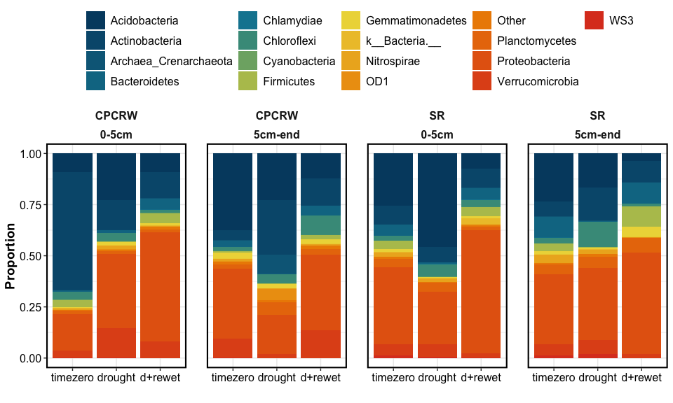

Part I: drying vs. rewetting
================

------------------------------------------------------------------------

RESEARCH QUESTIONS – click to open

------------------------------------------------------------------------

# FTICR

    #> $gg_vk_domains

<!-- -->

    #> 
    #> $gg_vk_domains_nosc

<!-- -->

<!-- -->

    #> $gg_pca_drying_vs_dw

<!-- -->

------------------------------------------------------------------------

# NMR

    #> $spectra_tzero

<!-- -->

    #> 
    #> $spectra_cpcrw

<!-- -->

    #> 
    #> $spectra_sr

<!-- -->

    #> $relabund_bar_cores

<!-- -->

    #> 
    #> $relabund_bar_top

<!-- -->

<!-- -->

    #> $permanova_tzero
    #> 
    #> Call:
    #> adonis(formula = rel_abund_wide %>% filter(length == "timezero") %>%      dplyr::select(aliphatic1, aliphatic2, aromatic, alphah, amide) ~      (Site)^2, data = rel_abund_wide %>% filter(length == "timezero")) 
    #> 
    #> Permutation: free
    #> Number of permutations: 5039
    #> 
    #> Terms added sequentially (first to last)
    #> 
    #>           Df SumsOfSqs  MeanSqs F.Model     R2 Pr(>F)
    #> Site       1  0.034751 0.034751  1.9367 0.2792  0.143
    #> Residuals  5  0.089715 0.017943         0.7208       
    #> Total      6  0.124466                  1.0000       
    #> 
    #> $permanova_drought_toponly
    #> 
    #> Call:
    #> adonis(formula = relabund_permanova %>% filter(depth == "0-5cm") %>%      dplyr::select(aliphatic1, aliphatic2, aromatic, alphah, amide) ~      (Site + saturation)^2, data = relabund_permanova %>% filter(depth ==      "0-5cm")) 
    #> 
    #> Permutation: free
    #> Number of permutations: 999
    #> 
    #> Terms added sequentially (first to last)
    #> 
    #>                 Df SumsOfSqs MeanSqs F.Model      R2 Pr(>F)  
    #> Site             1   0.11063 0.11063  0.8031 0.04317  0.391  
    #> saturation       1   1.02002 1.02002  7.4044 0.39803  0.016 *
    #> Site:saturation  1   0.05445 0.05445  0.3952 0.02125  0.664  
    #> Residuals       10   1.37758 0.13776         0.53756         
    #> Total           13   2.56267                 1.00000         
    #> ---
    #> Signif. codes:  0 '***' 0.001 '**' 0.01 '*' 0.05 '.' 0.1 ' ' 1

------------------------------------------------------------------------

# WEOC

<!-- -->

------------------------------------------------------------------------

# POM-nonPOM

<!-- -->

------------------------------------------------------------------------

------------------------------------------------------------------------

# Session Info

SESSION INFO – click to open

date run: 2021-12-29

    #> R version 4.1.1 (2021-08-10)
    #> Platform: x86_64-apple-darwin17.0 (64-bit)
    #> Running under: macOS Catalina 10.15.7
    #> 
    #> Matrix products: default
    #> BLAS:   /System/Library/Frameworks/Accelerate.framework/Versions/A/Frameworks/vecLib.framework/Versions/A/libBLAS.dylib
    #> LAPACK: /Library/Frameworks/R.framework/Versions/4.1/Resources/lib/libRlapack.dylib
    #> 
    #> locale:
    #> [1] en_US.UTF-8/en_US.UTF-8/en_US.UTF-8/C/en_US.UTF-8/en_US.UTF-8
    #> 
    #> attached base packages:
    #> [1] stats     graphics  grDevices utils     datasets  methods   base     
    #> 
    #> other attached packages:
    #>  [1] googlesheets4_1.0.0 picarro.data_0.1.1  agricolae_1.3-5    
    #>  [4] car_3.0-11          carData_3.0-4       nlme_3.1-153       
    #>  [7] stringi_1.7.5       ggExtra_0.9         ggalt_0.4.0        
    #> [10] lubridate_1.8.0     readxl_1.3.1        patchwork_1.1.1    
    #> [13] vegan_2.5-7         lattice_0.20-44     permute_0.9-5      
    #> [16] ggbiplot_0.55       soilpalettes_0.1.0  PNWColors_0.1.0    
    #> [19] forcats_0.5.1       stringr_1.4.0       dplyr_1.0.7        
    #> [22] purrr_0.3.4         readr_2.0.2         tidyr_1.1.4        
    #> [25] tibble_3.1.5        ggplot2_3.3.5       tidyverse_1.3.1    
    #> [28] drake_7.13.2       
    #> 
    #> loaded via a namespace (and not attached):
    #>   [1] googledrive_2.0.0  colorspace_2.0-2   ellipsis_0.3.2    
    #>   [4] rio_0.5.27         fs_1.5.0           rstudioapi_0.13   
    #>   [7] farver_2.1.0       bit64_4.0.5        fansi_0.5.0       
    #>  [10] xml2_1.3.2         splines_4.1.1      extrafont_0.17    
    #>  [13] knitr_1.36         jsonlite_1.7.2     broom_0.7.10      
    #>  [16] Rttf2pt1_1.3.9     cluster_2.1.2      dbplyr_2.1.1      
    #>  [19] shiny_1.7.1        compiler_4.1.1     httr_1.4.2        
    #>  [22] backports_1.2.1    assertthat_0.2.1   Matrix_1.3-4      
    #>  [25] fastmap_1.1.0      gargle_1.2.0       cli_3.0.1         
    #>  [28] later_1.3.0        htmltools_0.5.2    prettyunits_1.1.1 
    #>  [31] tools_4.1.1        igraph_1.2.6       gtable_0.3.0      
    #>  [34] glue_1.4.2         rappdirs_0.3.3     maps_3.3.0        
    #>  [37] Rcpp_1.0.7         cellranger_1.1.0   vctrs_0.3.8       
    #>  [40] extrafontdb_1.0    xfun_0.25          openxlsx_4.2.4    
    #>  [43] rvest_1.0.1        mime_0.11          miniUI_0.1.1.1    
    #>  [46] lifecycle_1.0.0    MASS_7.3-54        scales_1.1.1      
    #>  [49] vroom_1.5.4        hms_1.1.0          promises_1.2.0.1  
    #>  [52] parallel_4.1.1     proj4_1.0-10.1     RColorBrewer_1.1-2
    #>  [55] yaml_2.2.1         curl_4.3.2         labelled_2.8.0    
    #>  [58] AlgDesign_1.2.0    highr_0.9          klaR_0.6-15       
    #>  [61] filelock_1.0.2     zip_2.2.0          storr_1.2.5       
    #>  [64] rlang_0.4.11       pkgconfig_2.0.3    evaluate_0.14     
    #>  [67] labeling_0.4.2     bit_4.0.4          tidyselect_1.1.1  
    #>  [70] plyr_1.8.6         magrittr_2.0.1     R6_2.5.1          
    #>  [73] generics_0.1.0     combinat_0.0-8     base64url_1.4     
    #>  [76] txtq_0.2.4         DBI_1.1.1          pillar_1.6.2      
    #>  [79] haven_2.4.3        foreign_0.8-81     withr_2.4.2       
    #>  [82] mgcv_1.8-36        abind_1.4-5        ash_1.0-15        
    #>  [85] questionr_0.7.4    modelr_0.1.8       crayon_1.4.1      
    #>  [88] KernSmooth_2.23-20 utf8_1.2.2         tzdb_0.1.2        
    #>  [91] rmarkdown_2.11     progress_1.2.2     grid_4.1.1        
    #>  [94] data.table_1.14.2  reprex_2.0.1       digest_0.6.27     
    #>  [97] xtable_1.8-4       httpuv_1.6.2       openssl_1.4.4     
    #> [100] munsell_0.5.0      askpass_1.1

