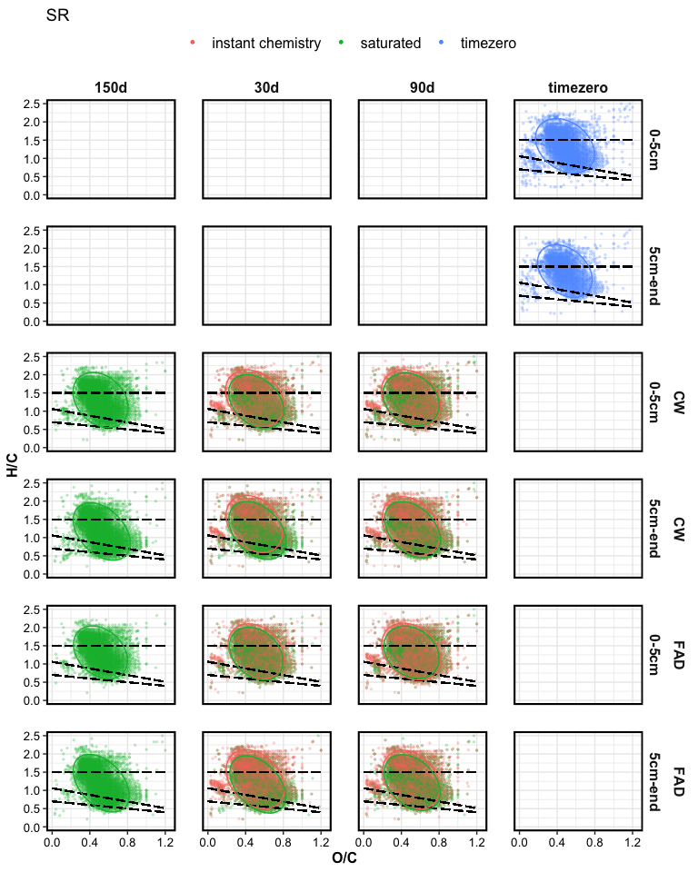

FTICR
================

This document contains results for FTICR-MS data.

## VAN KREVELEN PLOTS

### Van Krevelen domains

    #> $gg_vk_domains

<!-- -->

    #> 
    #> $gg_vk_domains_nosc

<!-- -->

### Van Krevelen plots by treatment

<!-- --><!-- -->

### Comparing drying types

<!-- --><!-- -->

### Peaks lost/gained during the saturation incubation

<!-- -->

## RELATIVE ABUNDANCE

<!-- -->

## PCA

    #> $gg_pca_overall1

<!-- -->

    #> 
    #> $gg_pca_overall2

<!-- -->

    #> 
    #> $gg_pca_cpcrw

<!-- -->

    #> 
    #> $gg_pca_sr

<!-- -->

## STATISTICS

### PERMANOVA

    #> # A tibble: 17 x 7
    #>    term                 df SumsOfSqs   MeanSqs F.Model      R2 p.value
    #>    <chr>             <dbl>     <dbl>     <dbl>   <dbl>   <dbl>   <dbl>
    #>  1 depth                 1   0.122    0.122     253.   0.275     0.001
    #>  2 Site                  1   0.0151   0.0151     31.3  0.0341    0.001
    #>  3 length                2   0.0110   0.00552    11.4  0.0249    0.001
    #>  4 drying                1   0.0115   0.0115     23.8  0.0258    0.001
    #>  5 saturation            1   0.126    0.126     261.   0.284     0.001
    #>  6 depth:Site            1   0.00312  0.00312     6.46 0.00703   0.009
    #>  7 depth:length          2   0.0133   0.00666    13.8  0.0300    0.001
    #>  8 depth:drying          1   0.00769  0.00769    15.9  0.0173    0.001
    #>  9 depth:saturation      1   0.0125   0.0125     26.0  0.0282    0.001
    #> 10 Site:length           2   0.00541  0.00270     5.61 0.0122    0.004
    #> 11 Site:drying           1   0.0260   0.0260     54.0  0.0588    0.001
    #> 12 Site:saturation       1   0.00619  0.00619    12.8  0.0140    0.001
    #> 13 length:drying         2   0.00410  0.00205     4.25 0.00925   0.013
    #> 14 length:saturation     1   0.00677  0.00677    14.0  0.0153    0.001
    #> 15 drying:saturation     1   0.00325  0.00325     6.75 0.00734   0.006
    #> 16 Residuals           144   0.0694   0.000482   NA    0.157    NA    
    #> 17 Total               163   0.443   NA          NA    1        NA
