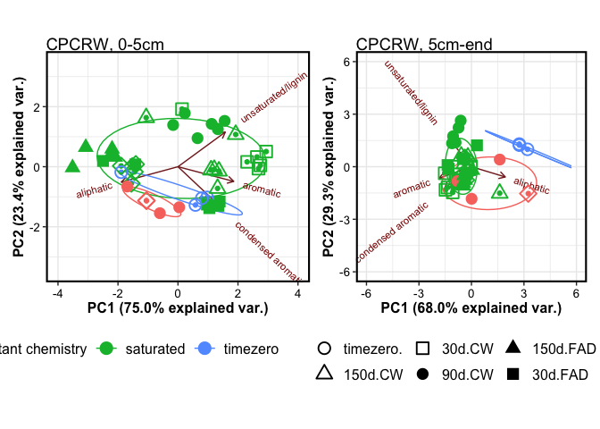
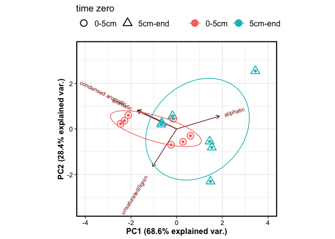
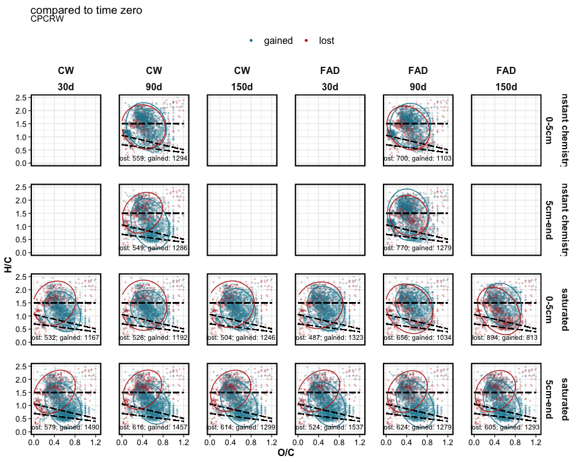

FTICR
================

This document contains results for FTICR-MS data.

------------------------------------------------------------------------

RESEARCH QUESTIONS – click to open

1.  effect of drought duration?
2.  effect of drought intensity? **CW** (constant weight drying)
    vs. **FAD** (forced air drying, more intense)
3.  effect of post-drought rewetting? instant rewet (no saturation)
    vs. 2 week saturation
4.  difference by site?
5.  difference by soil depth? 0-5 cm vs. 5cm-end

------------------------------------------------------------------------

EXPLORATORY ANALYSIS – click to open

## EXPLORATORY ANALYSIS

### Van Krevelen domains

    #> $gg_vk_domains

<!-- -->

    #> 
    #> $gg_vk_domains_nosc

<!-- -->

### Van Krevelen plots by treatment

<!-- --><!-- -->

### RELATIVE ABUNDANCE

<!-- -->

------------------------------------------------------------------------

PCA – click to open

## PCA

    #> $gg_pca_overall1

<!-- -->

    #> 
    #> $gg_pca_overall2

<!-- -->

    #> 
    #> $gg_pca_cpcrw

<!-- -->

    #> 
    #> $gg_pca_sr

<!-- -->

------------------------------------------------------------------------

TIME ZERO – click to open

## TIME ZERO SAMPLES

### Van Krevelen plots

<!-- -->

### PCA

<!-- -->

### PERMANOVA

    #> # A tibble: 5 x 7
    #>   term          df SumsOfSqs  MeanSqs F.Model     R2 p.value
    #>   <chr>      <dbl>     <dbl>    <dbl>   <dbl>  <dbl>   <dbl>
    #> 1 depth          1   0.00691  0.00691    4.24 0.241    0.026
    #> 2 Site           1   0.00380  0.00380    2.33 0.132    0.109
    #> 3 depth:Site     1   0.00172  0.00172    1.05 0.0598   0.376
    #> 4 Residuals     10   0.0163   0.00163   NA    0.567   NA    
    #> 5 Total         13   0.0287  NA         NA    1       NA

### Relative abundance

<!-- -->

------------------------------------------------------------------------

EFFECT OF DROUGHT – click to open

## HOW DID DROUGHT SAMPLES COMPARE TO TIME ZERO?

    #> $tz_diff_c_saturated

<!-- -->

    #> 
    #> $tz_diff_s_saturated

<!-- -->

------------------------------------------------------------------------

DROUGHT INTENSITY – click to open

## HOW DID DRYING (CW VS. FAD) INFLUENCE CHEMISTRY?

<!-- --><!-- -->

<!-- -->

------------------------------------------------------------------------

REWETTING – click to open

## HOW DID WETTING (INSTANT REWET VS. SATURATION INCUBATION) INFLUENCE CHEMISTRY?

<!-- -->

------------------------------------------------------------------------

OXIDATION STATE – click to open

## NOSC

NOSC by drying <!-- -->

NOSC by saturation
<!-- -->

------------------------------------------------------------------------

STATISTICS – click to open

## STATISTICS

### PERMANOVA

    #> # A tibble: 17 x 7
    #>    term              df SumsOfSqs  MeanSqs F.Model      R2 p.value
    #>    <chr>          <dbl>     <dbl>    <dbl>   <dbl>   <dbl>   <dbl>
    #>  1 depth              1   0.0981   9.81e-2  179.   0.191     0.001
    #>  2 Site               1   0.0166   1.66e-2   30.4  0.0324    0.001
    #>  3 length             3   0.0553   1.84e-2   33.7  0.108     0.001
    #>  4 drying             1   0.0115   1.15e-2   21.0  0.0223    0.001
    #>  5 saturation         1   0.125    1.25e-1  228.   0.243     0.001
    #>  6 depth:Site         1   0.00673  6.73e-3   12.3  0.0131    0.002
    #>  7 depth:length       3   0.0425   1.42e-2   25.9  0.0828    0.001
    #>  8 depth:drying       1   0.00770  7.70e-3   14.1  0.0150    0.001
    #>  9 depth:saturat…     1   0.0128   1.28e-2   23.4  0.0249    0.001
    #> 10 Site:length        3   0.00627  2.09e-3    3.82 0.0122    0.005
    #> 11 Site:drying        1   0.0260   2.60e-2   47.6  0.0507    0.001
    #> 12 Site:saturati…     1   0.00619  6.19e-3   11.3  0.0121    0.001
    #> 13 length:drying      2   0.00410  2.05e-3    3.75 0.00798   0.019
    #> 14 length:satura…     1   0.00677  6.77e-3   12.4  0.0132    0.001
    #> 15 drying:satura…     1   0.00325  3.25e-3    5.94 0.00633   0.013
    #> 16 Residuals        155   0.0848   5.47e-4   NA    0.165    NA    
    #> 17 Total            177   0.514   NA         NA    1        NA

------------------------------------------------------------------------

SESSION INFO – click to open

date run: 2021-02-18

    #> R version 4.0.2 (2020-06-22)
    #> Platform: x86_64-apple-darwin17.0 (64-bit)
    #> Running under: macOS Catalina 10.15.7
    #> 
    #> Matrix products: default
    #> BLAS:   /System/Library/Frameworks/Accelerate.framework/Versions/A/Frameworks/vecLib.framework/Versions/A/libBLAS.dylib
    #> LAPACK: /Library/Frameworks/R.framework/Versions/4.0/Resources/lib/libRlapack.dylib
    #> 
    #> locale:
    #> [1] en_US.UTF-8/en_US.UTF-8/en_US.UTF-8/C/en_US.UTF-8/en_US.UTF-8
    #> 
    #> attached base packages:
    #> [1] stats     graphics  grDevices utils     datasets  methods  
    #> [7] base     
    #> 
    #> other attached packages:
    #>  [1] patchwork_1.1.1    vegan_2.5-7        lattice_0.20-41   
    #>  [4] permute_0.9-5      ggbiplot_0.55      soilpalettes_0.1.0
    #>  [7] PNWColors_0.1.0    forcats_0.5.1      stringr_1.4.0     
    #> [10] dplyr_1.0.3        purrr_0.3.4        readr_1.4.0       
    #> [13] tidyr_1.1.2        tibble_3.0.6       ggplot2_3.3.3     
    #> [16] tidyverse_1.3.0    drake_7.13.0      
    #> 
    #> loaded via a namespace (and not attached):
    #>  [1] nlme_3.1-151       fs_1.5.0           lubridate_1.7.9.2 
    #>  [4] filelock_1.0.2     webshot_0.5.2      RColorBrewer_1.1-2
    #>  [7] progress_1.2.2     httr_1.4.2         tools_4.0.2       
    #> [10] backports_1.2.1    utf8_1.1.4         R6_2.5.0          
    #> [13] mgcv_1.8-33        DBI_1.1.1          lazyeval_0.2.2    
    #> [16] colorspace_2.0-0   withr_2.4.1        tidyselect_1.1.0  
    #> [19] gridExtra_2.3      prettyunits_1.1.1  compiler_4.0.2    
    #> [22] cli_2.2.0          rvest_0.3.6        TSP_1.1-10        
    #> [25] xml2_1.3.2         plotly_4.9.3       labeling_0.4.2    
    #> [28] scales_1.1.1       digest_0.6.27      txtq_0.2.3        
    #> [31] rmarkdown_2.6.6    pkgconfig_2.0.3    htmltools_0.5.1.1 
    #> [34] highr_0.8          dbplyr_2.0.0       htmlwidgets_1.5.3 
    #> [37] rlang_0.4.10       readxl_1.3.1       rstudioapi_0.13   
    #> [40] generics_0.1.0     farver_2.0.3       jsonlite_1.7.2    
    #> [43] dendextend_1.14.0  magrittr_2.0.1     Matrix_1.3-2      
    #> [46] Rcpp_1.0.6         munsell_0.5.0      fansi_0.4.2       
    #> [49] viridis_0.5.1      lifecycle_0.2.0    stringi_1.5.3     
    #> [52] yaml_2.2.1         MASS_7.3-53        storr_1.2.5       
    #> [55] plyr_1.8.6         grid_4.0.2         parallel_4.0.2    
    #> [58] crayon_1.4.0       splines_4.0.2      haven_2.3.1       
    #> [61] hms_1.0.0          knitr_1.31         pillar_1.4.7      
    #> [64] igraph_1.2.6       base64url_1.4      codetools_0.2-18  
    #> [67] reprex_1.0.0       glue_1.4.2         evaluate_0.14     
    #> [70] data.table_1.13.6  modelr_0.1.8       vctrs_0.3.6       
    #> [73] foreach_1.5.1      cellranger_1.1.0   gtable_0.3.0      
    #> [76] heatmaply_1.2.1    assertthat_0.2.1   xfun_0.20         
    #> [79] broom_0.7.4        viridisLite_0.3.0  seriation_1.2-9   
    #> [82] iterators_1.0.13   tinytex_0.29       registry_0.5-1    
    #> [85] cluster_2.1.0      ellipsis_0.3.1

