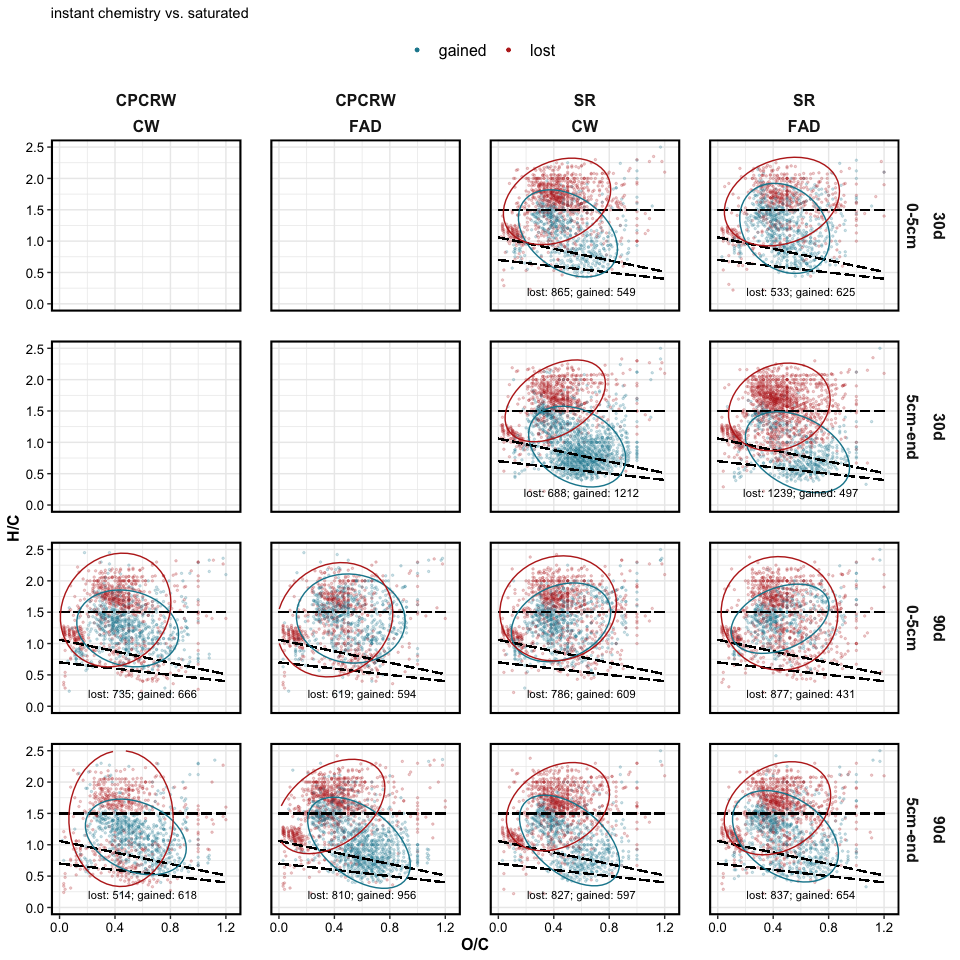
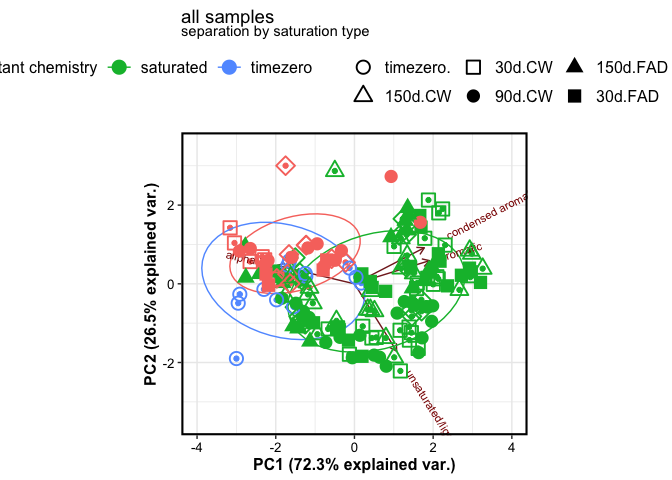

FTICR
================

This document contains results for FTICR-MS data.

## TIME ZERO SAMPLES

### Van Krevelen plots

<!-- -->

### PCA

<!-- -->

### PERMANOVA

    #> # A tibble: 5 x 7
    #>   term          df SumsOfSqs  MeanSqs F.Model     R2 p.value
    #>   <chr>      <dbl>     <dbl>    <dbl>   <dbl>  <dbl>   <dbl>
    #> 1 depth          1   0.00691  0.00691    4.24 0.241    0.026
    #> 2 Site           1   0.00380  0.00380    2.33 0.132    0.109
    #> 3 depth:Site     1   0.00172  0.00172    1.05 0.0598   0.376
    #> 4 Residuals     10   0.0163   0.00163   NA    0.567   NA    
    #> 5 Total         13   0.0287  NA         NA    1       NA

### Relative abundance

<!-- -->

## EXPLORATORY ANALYSIS

### Van Krevelen domains

    #> $gg_vk_domains

<!-- -->

    #> 
    #> $gg_vk_domains_nosc

<!-- -->

### Van Krevelen plots by treatment

<!-- --><!-- -->

### RELATIVE ABUNDANCE

<!-- -->

## NOSC

NOSC by drying <!-- -->

NOSC by saturation
<!-- -->

## HOW DID DRYING (CW VS. FAD) INFLUENCE CHEMISTRY?

<!-- --><!-- -->

<!-- -->

## HOW DID WETTING (INSTANT REWET VS. SATURATION INCUBATION) INFLUENCE CHEMISTRY?

<!-- -->

## HOW DID DROUGHT SAMPLES COMPARE TO TIME ZERO?

    #> $tz_diff_c_saturated

<!-- -->

    #> 
    #> $tz_diff_s_saturated

<!-- -->

## PCA

    #> $gg_pca_overall1

<!-- -->

    #> 
    #> $gg_pca_overall2

<!-- -->

    #> 
    #> $gg_pca_cpcrw

<!-- -->

    #> 
    #> $gg_pca_sr

<!-- -->

## STATISTICS

### PERMANOVA

    #> # A tibble: 17 x 7
    #>    term              df SumsOfSqs  MeanSqs F.Model      R2 p.value
    #>    <chr>          <dbl>     <dbl>    <dbl>   <dbl>   <dbl>   <dbl>
    #>  1 depth              1   0.0981   9.81e-2  179.   0.191     0.001
    #>  2 Site               1   0.0166   1.66e-2   30.4  0.0324    0.001
    #>  3 length             3   0.0553   1.84e-2   33.7  0.108     0.001
    #>  4 drying             1   0.0115   1.15e-2   21.0  0.0223    0.001
    #>  5 saturation         1   0.125    1.25e-1  228.   0.243     0.001
    #>  6 depth:Site         1   0.00673  6.73e-3   12.3  0.0131    0.002
    #>  7 depth:length       3   0.0425   1.42e-2   25.9  0.0828    0.001
    #>  8 depth:drying       1   0.00770  7.70e-3   14.1  0.0150    0.001
    #>  9 depth:saturat…     1   0.0128   1.28e-2   23.4  0.0249    0.001
    #> 10 Site:length        3   0.00627  2.09e-3    3.82 0.0122    0.005
    #> 11 Site:drying        1   0.0260   2.60e-2   47.6  0.0507    0.001
    #> 12 Site:saturati…     1   0.00619  6.19e-3   11.3  0.0121    0.001
    #> 13 length:drying      2   0.00410  2.05e-3    3.75 0.00798   0.019
    #> 14 length:satura…     1   0.00677  6.77e-3   12.4  0.0132    0.001
    #> 15 drying:satura…     1   0.00325  3.25e-3    5.94 0.00633   0.013
    #> 16 Residuals        155   0.0848   5.47e-4   NA    0.165    NA    
    #> 17 Total            177   0.514   NA         NA    1        NA
