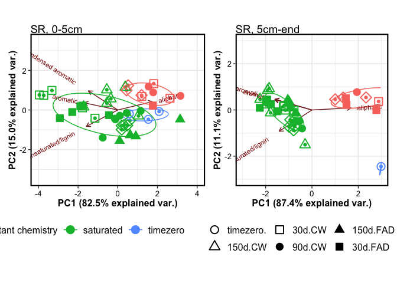
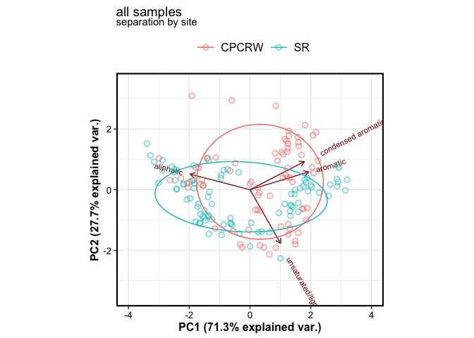
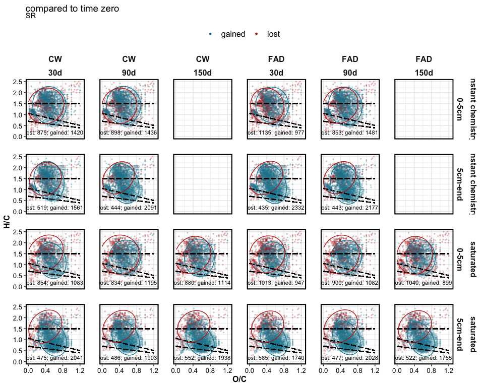

FTICR
================

This document contains results for FTICR-MS data.

------------------------------------------------------------------------

RESEARCH QUESTIONS – click to open

1.  effect of drought duration?
2.  effect of drought intensity? **CW** (constant weight drying)
    vs. **FAD** (forced air drying, more intense)
3.  effect of post-drought rewetting? instant rewet (no saturation)
    vs. 2 week saturation
4.  difference by site?
5.  difference by soil depth? 0-5 cm vs. 5cm-end

------------------------------------------------------------------------

EXPLORATORY ANALYSIS – click to open

## EXPLORATORY ANALYSIS

### Van Krevelen domains

    #> $gg_vk_domains

<!-- -->

    #> 
    #> $gg_vk_domains_nosc

<!-- -->

### Van Krevelen plots by treatment

<!-- --><!-- -->

### RELATIVE ABUNDANCE

<!-- -->

------------------------------------------------------------------------

PCA – click to open

## PCA

    #> $gg_pca_overall1

<!-- -->

    #> 
    #> $gg_pca_overall2

<!-- -->

    #> 
    #> $gg_pca_cpcrw

<!-- -->

    #> 
    #> $gg_pca_sr

<!-- -->

------------------------------------------------------------------------

TIME ZERO – click to open

## TIME ZERO SAMPLES

### Van Krevelen plots

<!-- -->

### PCA

<!-- -->

### PERMANOVA

    #> # A tibble: 5 x 7
    #>   term          df SumsOfSqs  MeanSqs F.Model     R2 p.value
    #>   <chr>      <dbl>     <dbl>    <dbl>   <dbl>  <dbl>   <dbl>
    #> 1 depth          1   0.00691  0.00691    4.24 0.241    0.026
    #> 2 Site           1   0.00380  0.00380    2.33 0.132    0.109
    #> 3 depth:Site     1   0.00172  0.00172    1.05 0.0598   0.376
    #> 4 Residuals     10   0.0163   0.00163   NA    0.567   NA    
    #> 5 Total         13   0.0287  NA         NA    1       NA

### Relative abundance

<!-- -->

class-wise ANOVA:

-   aromatic, condensed aromatic influenced by Site and depth
-   aliphatic, lignin did not change significantly by Site or depth

------------------------------------------------------------------------

STATISTICS – click to open

## STATISTICS

### PERMANOVA

    #> # A tibble: 17 x 7
    #>    term                 df SumsOfSqs   MeanSqs F.Model      R2 p.value
    #>    <chr>             <dbl>     <dbl>     <dbl>   <dbl>   <dbl>   <dbl>
    #>  1 depth                 1   0.122    0.122     253.   0.275     0.001
    #>  2 Site                  1   0.0151   0.0151     31.3  0.0341    0.001
    #>  3 length                2   0.0110   0.00552    11.4  0.0249    0.001
    #>  4 drying                1   0.0115   0.0115     23.8  0.0258    0.001
    #>  5 saturation            1   0.126    0.126     261.   0.284     0.001
    #>  6 depth:Site            1   0.00312  0.00312     6.46 0.00703   0.009
    #>  7 depth:length          2   0.0133   0.00666    13.8  0.0300    0.001
    #>  8 depth:drying          1   0.00769  0.00769    15.9  0.0173    0.001
    #>  9 depth:saturation      1   0.0125   0.0125     26.0  0.0282    0.001
    #> 10 Site:length           2   0.00541  0.00270     5.61 0.0122    0.004
    #> 11 Site:drying           1   0.0260   0.0260     54.0  0.0588    0.001
    #> 12 Site:saturation       1   0.00619  0.00619    12.8  0.0140    0.001
    #> 13 length:drying         2   0.00410  0.00205     4.25 0.00925   0.013
    #> 14 length:saturation     1   0.00677  0.00677    14.0  0.0153    0.001
    #> 15 drying:saturation     1   0.00325  0.00325     6.75 0.00734   0.006
    #> 16 Residuals           144   0.0694   0.000482   NA    0.157    NA    
    #> 17 Total               163   0.443   NA          NA    1        NA

PERMANOVA results for *drought samples only*. i.e. no time zero

-   All variables showed a significant influence on WEOC composition.
-   Saturation and depth were the strongest predictors, each accounting
    for **\~28 %** of total variation (see `R2` column).
-   Site, drought length, drought intensity were significant, but each
    accounted only for 2-3 % of total variation.

------------------------------------------------------------------------

PCA on drought samples – click to open

## PCA2

    #> $gg_pca_saturation

<!-- -->

    #> 
    #> $gg_pca_depth

<!-- -->

    #> 
    #> $gg_pca_length

<!-- -->

    #> 
    #> $gg_pca_drying

<!-- -->

    #> 
    #> $gg_pca_site

<!-- -->

------------------------------------------------------------------------

EFFECT OF DROUGHT – click to open

## HOW DID DROUGHT SAMPLES COMPARE TO TIME ZERO?

    #> $tz_diff_c_saturated

<!-- -->

    #> 
    #> $tz_diff_s_saturated

<!-- -->

------------------------------------------------------------------------

DROUGHT INTENSITY – click to open

## HOW DID DRYING (CW VS. FAD) INFLUENCE CHEMISTRY?

<!-- --><!-- -->

<!-- -->

<!-- -->

------------------------------------------------------------------------

REWETTING – click to open

## HOW DID WETTING (INSTANT REWET VS. SATURATION INCUBATION) INFLUENCE CHEMISTRY?

<!-- -->

<!-- -->

------------------------------------------------------------------------

OXIDATION STATE – click to open

## NOSC

NOSC by drying <!-- -->

NOSC by saturation
<!-- -->

------------------------------------------------------------------------

SESSION INFO – click to open

date run: 2021-02-28

    #> R version 4.0.2 (2020-06-22)
    #> Platform: x86_64-apple-darwin17.0 (64-bit)
    #> Running under: macOS Catalina 10.15.7
    #> 
    #> Matrix products: default
    #> BLAS:   /System/Library/Frameworks/Accelerate.framework/Versions/A/Frameworks/vecLib.framework/Versions/A/libBLAS.dylib
    #> LAPACK: /Library/Frameworks/R.framework/Versions/4.0/Resources/lib/libRlapack.dylib
    #> 
    #> locale:
    #> [1] en_US.UTF-8/en_US.UTF-8/en_US.UTF-8/C/en_US.UTF-8/en_US.UTF-8
    #> 
    #> attached base packages:
    #> [1] stats     graphics  grDevices utils     datasets  methods   base     
    #> 
    #> other attached packages:
    #>  [1] ggExtra_0.9        cluster_2.1.0      patchwork_1.1.1    vegan_2.5-7       
    #>  [5] lattice_0.20-41    permute_0.9-5      ggbiplot_0.55      soilpalettes_0.1.0
    #>  [9] PNWColors_0.1.0    forcats_0.5.1      stringr_1.4.0      dplyr_1.0.4       
    #> [13] purrr_0.3.4        readr_1.4.0        tidyr_1.1.2        tibble_3.0.6      
    #> [17] ggplot2_3.3.3      tidyverse_1.3.0    drake_7.13.1      
    #> 
    #> loaded via a namespace (and not attached):
    #>  [1] nlme_3.1-152      fs_1.5.0          lubridate_1.7.9.2 filelock_1.0.2    progress_1.2.2   
    #>  [6] httr_1.4.2        tools_4.0.2       backports_1.2.1   utf8_1.1.4        R6_2.5.0         
    #> [11] DBI_1.1.1         mgcv_1.8-33       colorspace_2.0-0  withr_2.4.1       tidyselect_1.1.0 
    #> [16] prettyunits_1.1.1 curl_4.3          compiler_4.0.2    cli_2.2.0         rvest_0.3.6      
    #> [21] xml2_1.3.2        labeling_0.4.2    scales_1.1.1      digest_0.6.27     foreign_0.8-81   
    #> [26] txtq_0.2.3        rmarkdown_2.6.6   rio_0.5.16        pkgconfig_2.0.3   htmltools_0.5.1.1
    #> [31] fastmap_1.1.0     highr_0.8         dbplyr_2.0.0      rlang_0.4.10      readxl_1.3.1     
    #> [36] rstudioapi_0.13   shiny_1.6.0       generics_0.1.0    farver_2.0.3      jsonlite_1.7.2   
    #> [41] zip_2.1.1         car_3.0-10        magrittr_2.0.1    Matrix_1.3-2      Rcpp_1.0.6       
    #> [46] munsell_0.5.0     fansi_0.4.2       abind_1.4-5       lifecycle_0.2.0   stringi_1.5.3    
    #> [51] yaml_2.2.1        carData_3.0-4     MASS_7.3-53       storr_1.2.5       plyr_1.8.6       
    #> [56] grid_4.0.2        promises_1.1.1    parallel_4.0.2    crayon_1.4.0      miniUI_0.1.1.1   
    #> [61] cowplot_1.1.1     haven_2.3.1       splines_4.0.2     hms_1.0.0         knitr_1.31       
    #> [66] pillar_1.4.7      igraph_1.2.6      base64url_1.4     reprex_1.0.0      glue_1.4.2       
    #> [71] evaluate_0.14     data.table_1.13.6 modelr_0.1.8      httpuv_1.5.5      vctrs_0.3.6      
    #> [76] cellranger_1.1.0  gtable_0.3.0      assertthat_0.2.1  xfun_0.20         openxlsx_4.2.3   
    #> [81] mime_0.9          xtable_1.8-4      broom_0.7.4       later_1.1.0.1     ellipsis_0.3.1

