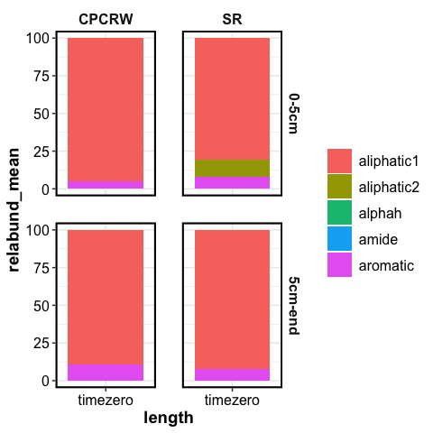
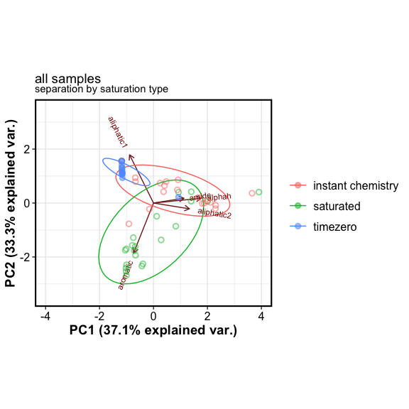
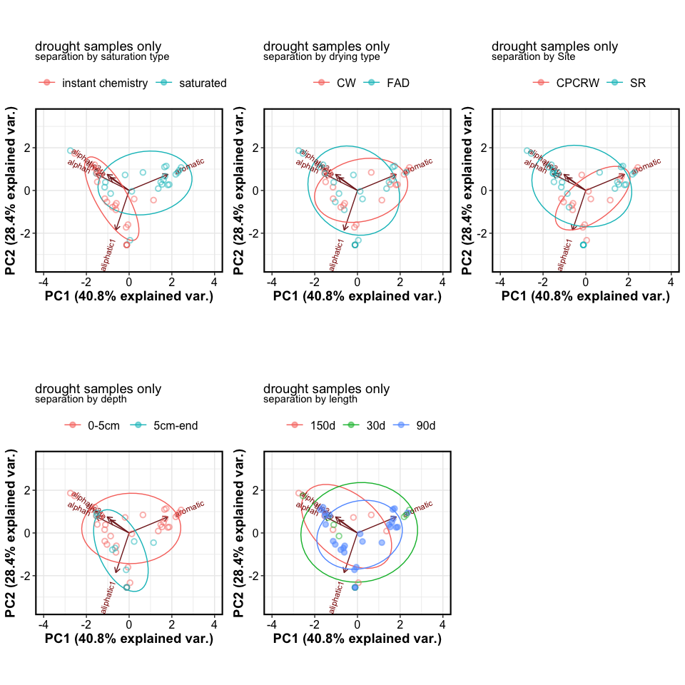
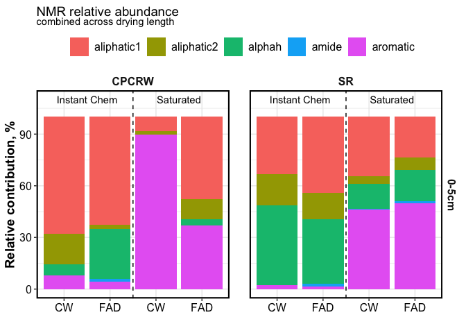
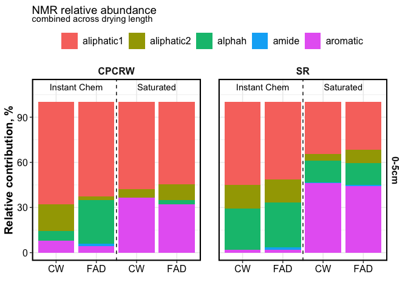
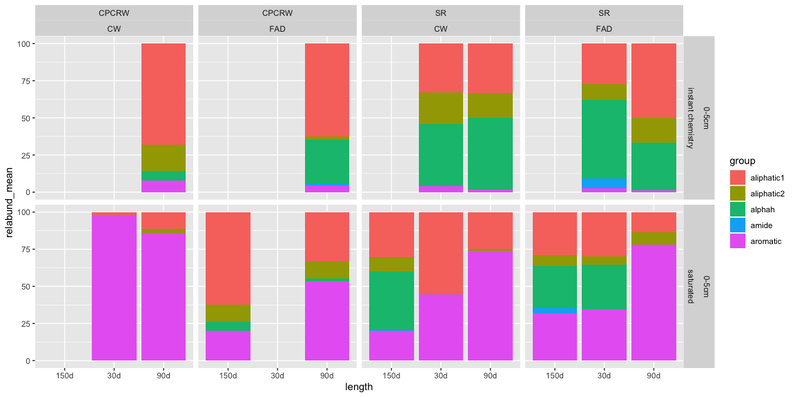
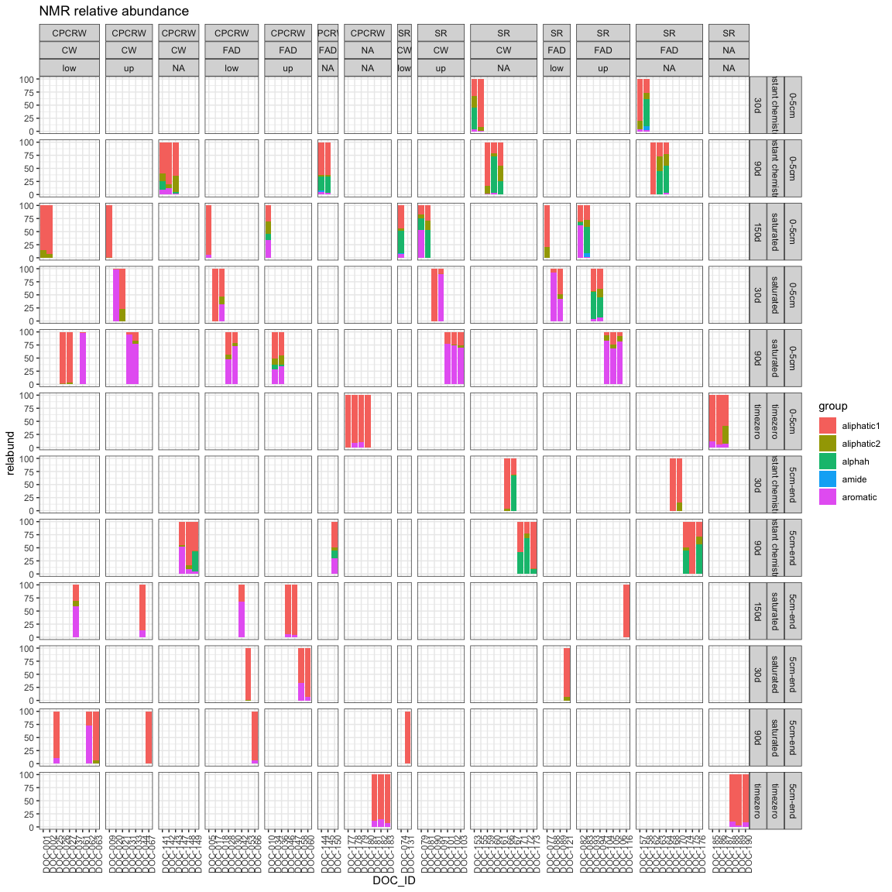
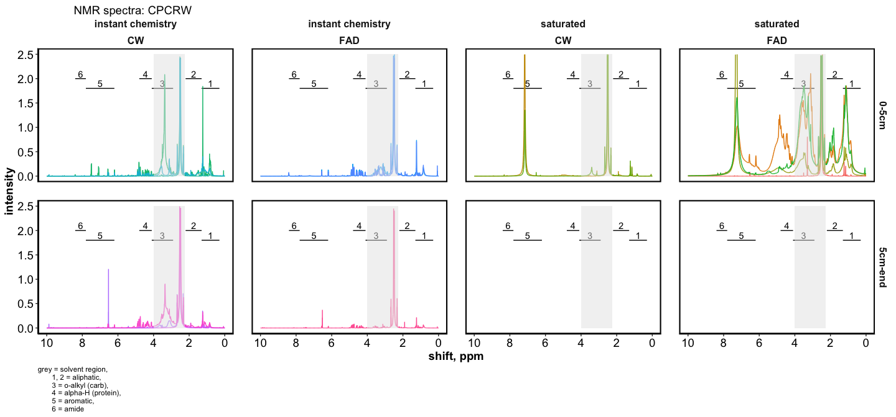
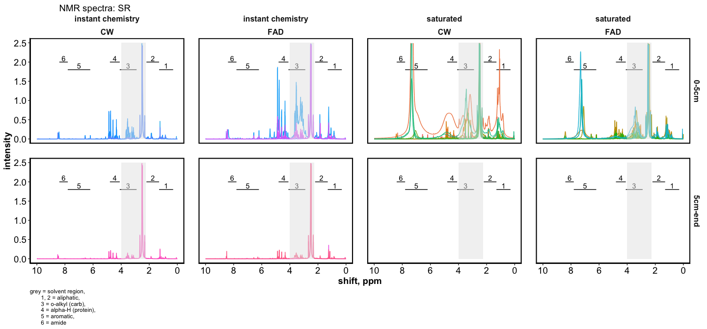

NMR
================

------------------------------------------------------------------------

Time Zero – click to open

## Time Zero

Time Zero soils had mostly aliphatic groups, with &lt; 15 % aromatic

<!-- -->

#### PERMANOVA

| term       |  df | SumsOfSqs |   MeanSqs |   F.Model |        R2 | p.value |
|:-----------|----:|----------:|----------:|----------:|----------:|--------:|
| Site       |   1 | 0.0138914 | 0.0138914 | 1.3125504 | 0.1019612 |   0.252 |
| depth      |   1 | 0.0056740 | 0.0056740 | 0.5361151 | 0.0416464 |   0.795 |
| Site:depth |   1 | 0.0214249 | 0.0214249 | 2.0243682 | 0.1572565 |   0.093 |
| Residuals  |   9 | 0.0952515 | 0.0105835 |        NA | 0.6991359 |      NA |
| Total      |  12 | 0.1362417 |        NA |        NA | 1.0000000 |      NA |

For time-zero samples, NMR-based composition did not differ by Site or
depth.

------------------------------------------------------------------------

Drought Samples - Statistics

In drought-incubated samples, NMR-based composition was significantly
influenced by saturation type, Site, and depth. Drought length or
drought intensity did not significantly influence WEOC composition.

Saturation type (instant chemistry vs. saturated) accounted for 32 % of
total variation (R2 value).

| term              |  df | SumsOfSqs |   MeanSqs |    F.Model |        R2 | p.value |
|:------------------|----:|----------:|----------:|-----------:|----------:|--------:|
| Site              |   1 | 0.3575016 | 0.3575016 |  3.2814258 | 0.0485564 |   0.050 |
| depth             |   1 | 0.4924429 | 0.4924429 |  4.5200211 | 0.0668843 |   0.012 |
| length            |   2 | 0.1439206 | 0.0719603 |  0.6605073 | 0.0195475 |   0.616 |
| saturation        |   1 | 2.3813536 | 2.3813536 | 21.8579005 | 0.3234388 |   0.001 |
| drying            |   1 | 0.0107826 | 0.0107826 |  0.0989709 | 0.0014645 |   0.918 |
| Site:depth        |   1 | 0.0559697 | 0.0559697 |  0.5137328 | 0.0076019 |   0.597 |
| Site:length       |   2 | 0.2393904 | 0.1196952 |  1.0986548 | 0.0325143 |   0.373 |
| Site:saturation   |   1 | 0.1258691 | 0.1258691 |  1.1553238 | 0.0170957 |   0.318 |
| Site:drying       |   1 | 0.0790024 | 0.0790024 |  0.7251451 | 0.0107302 |   0.472 |
| depth:length      |   1 | 0.2102466 | 0.2102466 |  1.9298057 | 0.0285560 |   0.150 |
| depth:drying      |   1 | 0.0442733 | 0.0442733 |  0.4063749 | 0.0060133 |   0.673 |
| length:saturation |   1 | 0.1825997 | 0.1825997 |  1.6760410 | 0.0248009 |   0.189 |
| length:drying     |   2 | 0.1329875 | 0.0664938 |  0.6103311 | 0.0180626 |   0.657 |
| saturation:drying |   1 | 0.0736463 | 0.0736463 |  0.6759826 | 0.0100027 |   0.503 |
| Residuals         |  26 | 2.8326231 | 0.1089470 |         NA | 0.3847309 |      NA |
| Total             |  43 | 7.3626096 |        NA |         NA | 1.0000000 |      NA |

------------------------------------------------------------------------

PCA

#### Including Time Zero samples

<!-- -->

Time-zero samples had a greater contribution of aliphatic groups.
Instant-rewet samples had a greater contribution of aliphatic, alpha-H
and amide groups. Saturated soils had a greater contribution of aromatic
groups.

#### Only drought samples (no Time Zero)

<!-- -->

------------------------------------------------------------------------

Relative abundance bar plots for all samples

<!-- -->

<!-- -->

<!-- -->

------------------------------------------------------------------------

NMR Spectra

    #> $spectra_tzero

<!-- -->

    #> 
    #> $spectra_cpcrw

<!-- -->

    #> 
    #> $spectra_sr

<!-- -->

------------------------------------------------------------------------

------------------------------------------------------------------------

Session Info

date run: 2021-06-08

    #> R version 4.0.2 (2020-06-22)
    #> Platform: x86_64-apple-darwin17.0 (64-bit)
    #> Running under: macOS Catalina 10.15.7
    #> 
    #> Matrix products: default
    #> BLAS:   /System/Library/Frameworks/Accelerate.framework/Versions/A/Frameworks/vecLib.framework/Versions/A/libBLAS.dylib
    #> LAPACK: /Library/Frameworks/R.framework/Versions/4.0/Resources/lib/libRlapack.dylib
    #> 
    #> locale:
    #> [1] en_US.UTF-8/en_US.UTF-8/en_US.UTF-8/C/en_US.UTF-8/en_US.UTF-8
    #> 
    #> attached base packages:
    #> [1] stats     graphics  grDevices utils     datasets  methods   base     
    #> 
    #> other attached packages:
    #>  [1] vegan_2.5-7        lattice_0.20-41    permute_0.9-5      picarro.data_0.1.1
    #>  [5] forcats_0.5.1      stringr_1.4.0      dplyr_1.0.6        purrr_0.3.4       
    #>  [9] readr_1.4.0        tidyr_1.1.3        tibble_3.1.2       tidyverse_1.3.1   
    #> [13] drake_7.13.1       agricolae_1.3-3    car_3.0-10         carData_3.0-4     
    #> [17] nlme_3.1-152       stringi_1.5.3      ggExtra_0.9        ggalt_0.6.2       
    #> [21] ggplot2_3.3.3      lubridate_1.7.10   readxl_1.3.1      
    #> 
    #> loaded via a namespace (and not attached):
    #>  [1] colorspace_2.0-0   ellipsis_0.3.2     rio_0.5.16         ggbiplot_0.55     
    #>  [5] fs_1.5.0           rstudioapi_0.13    farver_2.0.3       fansi_0.4.2       
    #>  [9] xml2_1.3.2         splines_4.0.2      extrafont_0.17     knitr_1.31        
    #> [13] jsonlite_1.7.2     broom_0.7.6        Rttf2pt1_1.3.8     cluster_2.1.0     
    #> [17] dbplyr_2.1.1       shiny_1.6.0        compiler_4.0.2     httr_1.4.2        
    #> [21] backports_1.2.1    assertthat_0.2.1   Matrix_1.3-2       fastmap_1.1.0     
    #> [25] cli_2.5.0          later_1.1.0.1      htmltools_0.5.1.1  prettyunits_1.1.1 
    #> [29] tools_4.0.2        igraph_1.2.6       gtable_0.3.0       glue_1.4.2        
    #> [33] maps_3.3.0         tinytex_0.29       Rcpp_1.0.6         cellranger_1.1.0  
    #> [37] vctrs_0.3.8        extrafontdb_1.0    xfun_0.20          openxlsx_4.2.3    
    #> [41] rvest_1.0.0        mime_0.9           miniUI_0.1.1.1     lifecycle_1.0.0   
    #> [45] MASS_7.3-53        scales_1.1.1       hms_1.0.0          promises_1.1.1    
    #> [49] parallel_4.0.2     proj4_1.0-10.1     RColorBrewer_1.1-2 yaml_2.2.1        
    #> [53] curl_4.3           labelled_2.7.0     highr_0.8          klaR_0.6-15       
    #> [57] AlgDesign_1.2.0    filelock_1.0.2     zip_2.1.1          storr_1.2.5       
    #> [61] rlang_0.4.10       pkgconfig_2.0.3    evaluate_0.14      labeling_0.4.2    
    #> [65] cowplot_1.1.1      tidyselect_1.1.0   plyr_1.8.6         magrittr_2.0.1    
    #> [69] R6_2.5.0           generics_0.1.0     base64url_1.4      combinat_0.0-8    
    #> [73] txtq_0.2.3         DBI_1.1.1          pillar_1.6.1       haven_2.3.1       
    #> [77] foreign_0.8-81     withr_2.4.1        mgcv_1.8-33        abind_1.4-5       
    #> [81] ash_1.0-15         modelr_0.1.8       crayon_1.4.1       questionr_0.7.4   
    #> [85] KernSmooth_2.23-18 utf8_1.1.4         rmarkdown_2.6.6    progress_1.2.2    
    #> [89] grid_4.0.2         data.table_1.13.6  reprex_2.0.0       digest_0.6.27     
    #> [93] xtable_1.8-4       httpuv_1.5.5       munsell_0.5.0

